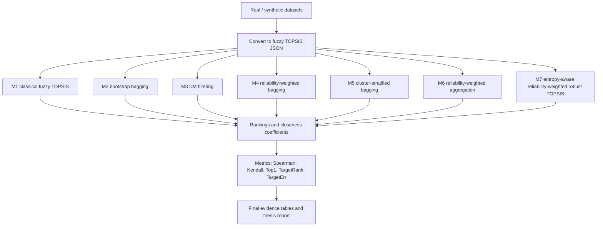

# EARR-TOPSIS Code File Guide

This guide explains where each method lives, what each code file does, and how the project flows from raw data to final thesis/journal evidence.

## 1. Big Picture

The project has four layers:

1. Method layer: `m1_normal_topsis.py` to `m7_entropy_reliability.py`.
2. Reliability/helper layer: `reliability.py` and shared functions in `m1_normal_topsis.py`.
3. Experiment layer: benchmark, attack-curve, baseline, statistics, and runtime scripts.
4. Delivery layer: thesis LaTeX files, evidence tables, and the web API.



## 2. Method Files

### M1: Classical fuzzy TOPSIS

File: `m1_normal_topsis.py`

This is the base method and also contains the shared fuzzy TOPSIS core used by the other methods.

Important functions:

| Function | Line | Purpose |
|---|---:|---|
| `load_data(filepath)` | 7 | Loads one JSON dataset. |
| `aggregate_ratings(data)` | 11 | Textbook M1 aggregation: lower=min, middle=mean, upper=max across DMs. |
| `aggregate_ratings_mean(data)` | 34 | Mean TFN aggregation used by bagged/ensemble methods. |
| `_criterion_is_cost(...)` | 67 | Detects whether a criterion is cost-type. |
| `normalize_matrix(...)` | 86 | Normalizes benefit and cost criteria. |
| `apply_weights(...)` | 115 | Applies fuzzy criterion weights. |
| `calculate_distances(...)` | 128 | Computes distance from FPIS and FNIS. |
| `compute_cc(...)` | 156 | Computes TOPSIS closeness coefficient. |
| `run_m1(filepath)` | 163 | Full M1 pipeline. |

Conceptually:

```text
raw DM ratings
-> aggregate all DMs
-> normalize criteria
-> apply weights
-> compute distance to positive/negative ideal
-> closeness coefficient
-> final ranking
```

M1 is your baseline. It is vulnerable because all DMs are aggregated directly, so biased DMs can pull the group matrix.

### M2: Bootstrap bagged fuzzy TOPSIS

File: `m2_bagged_topsis.py`

Important function:

| Function | Line | Purpose |
|---|---:|---|
| `run_m2(filepath, num_bags=100, bag_size=None, seed=None)` | 27 | Runs true bootstrap bagging with replacement. |

What M2 does:

1. Sample decision makers with replacement.
2. Run fuzzy TOPSIS on each bag.
3. Aggregate the bag rankings using Borda-style rank scores.
4. Average closeness coefficients across bags.

This method is now corrected to use true bootstrap sampling. It is useful as a strong baseline, but it is not one of the final three proposed methods because it does not know which DMs are reliable.

### M3: Reliability/outlier filtered fuzzy TOPSIS

File: `m3_ml_filtered.py`

Important function:

| Function | Line | Purpose |
|---|---:|---|
| `run_m3(filepath)` | 15 | Removes detected outlier DMs, then runs fuzzy TOPSIS. |

What M3 does:

1. Calls `detect_outliers(data)` from `reliability.py`.
2. Keeps only non-outlier DMs.
3. Runs normal fuzzy TOPSIS on the filtered group.

M3 is a hard-filter method. It can be very strong when biased DMs are obvious outliers, but risky if minority experts look different for legitimate reasons.

### M4: Reliability-weighted bootstrap bagging

File: `m4_weighted_bagging.py`

Important function:

| Function | Line | Purpose |
|---|---:|---|
| `run_m4(filepath, num_bags=100, bag_size=None, seed=None)` | 20 | Samples DMs with probabilities proportional to reliability. |

What M4 does:

1. Computes DM reliability using `compute_reliability(data)`.
2. Converts reliability values into sampling probabilities.
3. Creates bootstrap bags where reliable DMs are more likely to appear.
4. Runs fuzzy TOPSIS per bag.
5. Aggregates bag rankings and closeness values.

M4 is Proposed Method 1. It improves M2 by saying: do not sample every DM equally; sample more reliable DMs more often.

### M5: Cluster-stratified bagging

File: `m5_cluster_stratified.py`

Important function:

| Function | Line | Purpose |
|---|---:|---|
| `run_m5(filepath, num_bags=100, bag_size=None, seed=None)` | 18 | Clusters DMs and samples from reliable clusters. |

What M5 does:

1. Builds DM feature vectors.
2. Clusters decision makers.
3. Computes reliability for each cluster.
4. Samples DMs in a stratified way from the reliable clusters.
5. Runs fuzzy TOPSIS per bag and aggregates the results.

M5 is an important experimental branch. It represents a cluster/diversity idea, but it is not as consistent as M4/M6/M7 in the final evidence, so it is better used as an ablation or intermediate method rather than a main proposed method.

### M6: Reliability-weighted aggregation with bag weighting

File: `m6_reliability_weighted.py`

Important functions:

| Function | Line | Purpose |
|---|---:|---|
| `aggregate_ratings_weighted(data, R)` | 18 | Aggregates TFNs using reliability as weights. |
| `run_m6(filepath, num_bags=100, bag_size=None, seed=None)` | 49 | Runs bootstrap bags, then reliability-weighted aggregation inside each bag. |

What M6 does:

1. Computes reliability for each DM.
2. Samples bootstrap bags.
3. Inside each bag, aggregates TFNs using reliability-weighted means.
4. Runs TOPSIS on each bag.
5. Gives stronger bags more influence using softmax weighting.

M6 is Proposed Method 2. Its key idea is stronger than M4: reliability should not only affect who gets sampled; it should also affect how much each DM contributes inside the fuzzy matrix.

### M7: Entropy-aware reliability-weighted robust fuzzy TOPSIS

File: `m7_entropy_reliability.py`

Important functions:

| Function | Line | Purpose |
|---|---:|---|
| `flatten_dm_vector(data, dm)` | 39 | Converts one DM's full ratings into one numerical vector. |
| `compute_entropy(vec, bins=10)` | 53 | Measures distributional uncertainty/information spread. |
| `compute_variance_score(vec, global_var)` | 70 | Scores whether a DM's variability is suspiciously high/low. |
| `cosine_similarity(a, b)` | 86 | Measures similarity between DMs. |
| `compute_m7_reliability(data)` | 98 | Computes the final M7 reliability score from entropy, variance, and clone signals. |
| `aggregate_ratings_weighted(data, R)` | 213 | Reliability-weighted TFN aggregation. |
| `softmax(values)` | 248 | Converts bag quality values into bag weights. |
| `run_m7(filepath, num_bags=100, bag_size=None, seed=None)` | 265 | Full M7/EARR-TOPSIS pipeline. |

What M7 does:

1. Represents each DM as a complete rating vector.
2. Computes multiple reliability signals:
   - entropy signal,
   - variance signal,
   - clone/similarity signal.
3. Combines the signals into one reliability score.
4. Uses reliability-aware bootstrap sampling.
5. Uses reliability-weighted fuzzy aggregation inside bags.
6. Uses bag-level reliability/quality weighting.
7. Produces final closeness coefficients and ranking.

M7 is Proposed Method 3 and the final flagship method. In the paper, call it EARR-TOPSIS: Entropy-Aware Reliability-Weighted Robust Fuzzy TOPSIS.

## 3. Shared Reliability Code

File: `reliability.py`

This file supports M3, M4, M5, and M6.

Important functions:

| Function | Line | Purpose |
|---|---:|---|
| `extract_dm_features(data, dm_id)` | 19 | Turns a DM's ratings into feature values. |
| `build_feature_matrix(data)` | 30 | Builds the full DM feature matrix. |
| `compute_reliability(data)` | 41 | Computes consensus-distance reliability for each DM. |
| `detect_outliers(data)` | 76 | Detects low-reliability/outlier DMs. |
| `find_optimal_clusters(data, max_k=None)` | 259 | Finds clusters for M5. |
| `softmax_weights(values)` | 309 | Turns values into normalized softmax weights. |
| `reliability_weighted_probs(R_dict, dm_list)` | 336 | Converts reliability into sampling probabilities. |
| `compute_cluster_reliability(clusters, R)` | 351 | Computes cluster-level reliability. |
| `exclude_outlier_clusters(clusters, R)` | 357 | Excludes unreliable clusters. |

The main reliability idea here is consensus distance:

```text
DM vector -> compare to group median/center -> farther means less reliable
```

This is simpler than M7's reliability score. M7 adds entropy, variance, and clone detection.

## 4. Older / Experimental Method Variants

These files are useful historically, but they are not the final proposed methods:

| File | Purpose |
|---|---|
| `m4_disjoint.py` | Earlier disjoint-subset version of M4. |
| `m5_disjoint.py` | Earlier disjoint-subset version of M5. |
| `m6_disjoint.py` | Earlier disjoint-subset version of M6. |

Use them only if you need to explain method evolution during development. Do not use them as the main paper algorithms.

## 5. Dataset Generation / Proof Scripts

| File | Purpose |
|---|---|
| `generate_topsis_data.py` | Generates synthetic fuzzy TOPSIS data and biased variants. |
| `run_all_tests.py` | Earlier synthetic test runner for all methods. |
| `simulate_bagging.py` | Small simulation for bagging behavior under biased DM percentages. |
| `proof_standard_topsis.py` | Minimal code proof for standard TOPSIS behavior. |
| `proof_of_bagging_vulnerability.py` | Demonstrates why naive bagging can still fail. |
| `test_m2_all_data.py` | Specific checks for M2. |
| `test_disjoint_layer3.py` | Tests old disjoint-layer experiments. |

These scripts helped during research exploration. For final thesis evidence, the most important scripts are in the next section.

## 6. Main Benchmark and Evidence Scripts

### Real/pseudo-real dataset benchmark

File: `run_real_dataset_benchmarks.py`

Important functions:

| Function | Line | Purpose |
|---|---:|---|
| `METHODS` | 47 | Defines M1-M7 method runners. |
| `tfn_from_score(...)` | 58 | Converts crisp scores into fuzzy triangular numbers. |
| `convert_supplier_workbook(...)` | 104 | Converts supplier Excel datasets. |
| `convert_crisp_rows(...)` | 189 | Converts tabular crisp data into fuzzy TOPSIS JSON. |
| `convert_car_dataset(...)` | 242 | Converts UCI car evaluation dataset. |
| `load_real_datasets(...)` | 265 | Loads all supported real datasets. |
| `inject_synthetic_bias(...)` | 328 | Adds controlled synthetic bias into real datasets. |
| `spearman_rho(...)` | 348 | Ranking similarity metric. |
| `kendall_tau(...)` | 358 | Ranking similarity metric. |
| `evaluate_dataset(...)` | 400 | Runs all methods and computes metrics. |
| `main()` | 461 | Command-line entry point. |

This is the main script you used for the results:

```bash
python run_real_dataset_benchmarks.py --datasets healthcare_countries_2021 --max-alternatives 0 --repeats 30 --num-bags 200 --attacker-fraction 0.3
```

### Attack-fraction curves

File: `run_attack_fraction_curves.py`

This tests how methods behave as attacker fraction increases, usually from 10% to 60%.

Important outputs:

| Output | Purpose |
|---|---|
| `outputs/attack_fraction_curves/attack_fraction_summary.csv` | Main attack-fraction summary. |
| `outputs/final_evidence/attack_fraction_target_rank_wide.csv` | Frozen table form. |
| `outputs/final_evidence/attack_fraction_target_rank_table.tex` | LaTeX table. |

### External baselines

Files:

| File | Purpose |
|---|---|
| `external_baselines.py` | Implements prior-art/comparator methods. |
| `run_external_baselines.py` | Runs the external baselines and compares them with M4/M6/M7. |

Important baseline functions in `external_baselines.py`:

| Function | Line | Purpose |
|---|---:|---|
| `run_median_topsis(...)` | 120 | Component-wise median aggregation. |
| `run_trimmed_mean_topsis(...)` | 125 | Trimmed mean aggregation. |
| `run_mad_consensus_topsis(...)` | 130 | MAD-based consensus filtering. |
| `run_individual_borda_topsis(...)` | 139 | Individual TOPSIS then Borda aggregation. |
| `run_huang_li_group_ideal_topsis(...)` | 160 | Group-ideal fuzzy TOPSIS comparator. |
| `BASELINES` | 223 | Registry of external baselines. |

### Statistical tests

File: `analyze_statistics.py`

This produces confidence intervals and pairwise method tests.

Important outputs:

| Output | Purpose |
|---|---|
| `outputs/statistical_analysis/attack_fraction_ci95.csv` | 95% CI table. |
| `outputs/statistical_analysis/m7_pairwise_target_error_tests.csv` | Pairwise tests for M7 vs others. |
| `outputs/statistical_analysis/method_target_error_summary.csv` | Method-level summary. |

### Runtime/scalability

File: `run_runtime_scalability.py`

This measures runtime for the main methods on benchmark datasets. It supports the claim that the method is computationally practical.

Important output:

| Output | Purpose |
|---|---|
| `outputs/runtime_scalability/runtime_scalability.csv` | Runtime table. |

### Final evidence compiler

File: `compile_final_evidence.py`

This gathers benchmark outputs, external baselines, statistics, and runtime results into final CSV/LaTeX/Markdown evidence.

Important output folder:

```text
outputs/final_evidence/
```

Key files inside:

| File | Purpose |
|---|---|
| `final_evidence_report.md` | Main result report. |
| `completion_status_report.md` | What is done and what remains. |
| `real_contaminated_target_summary_wide.csv` | Focused real-data target-rank results. |
| `external_baseline_target_rank_wide.csv` | External comparator table. |
| `method_target_error_summary.csv` | Overall method summary. |
| `runtime_scalability.csv` | Runtime table. |
| `*.tex` tables | Tables included in thesis LaTeX. |

## 7. Special Test Scripts

| File | Purpose |
|---|---|
| `test_m7_supermajority.py` | Tests whether M7 can resist larger structured attacker groups. |
| `test_m7_adversarial.py` | Tests adaptive/human-mimic attacks. These are stress tests, not normal real-data tests. |
| `test_m7_ablation.py` | Tests which M7 reliability signals matter. |
| `run_repeated_synthetic_evaluation.py` | Repeated synthetic experiments across several DM/attacker settings. |
| `run_massive_scale_tests.py` | Larger-scale synthetic experiments. |

Use these to explain research robustness, boundaries, and limitations.

## 8. Web API / GitHub Demo

Folder: `web_api/`

Important files:

| File | Purpose |
|---|---|
| `web_api/app.py` | FastAPI backend and upload parser. |
| `web_api/static/index.html` | Simple web interface. |
| `web_api/examples/example_native.json` | Native fuzzy TOPSIS JSON example. |
| `web_api/examples/example_flat_fuzzy.csv` | Flat fuzzy CSV example. |
| `web_api/examples/example_crisp.csv` | Crisp CSV example converted to fuzzy internally. |
| `web_api/README.md` | How to run and test the API. |

Important functions in `web_api/app.py`:

| Function | Line | Purpose |
|---|---:|---|
| `_flat_rows_to_dataset(...)` | 71 | Parses flat fuzzy CSV/XLSX upload. |
| `_crisp_rows_to_dataset(...)` | 112 | Converts ordinary crisp tables into pseudo-DM fuzzy TOPSIS datasets. |
| `parse_upload(...)` | 153 | Detects JSON/CSV/XLSX and parses it. |
| `run_method(...)` | 172 | Calls M4, M6, or M7. |
| `/health` | 196 | Health check endpoint. |
| `/api/run` | 201 | Main endpoint for uploaded datasets. |
| `/api/example` | 240 | Returns expected input examples. |

The API exposes the final proposed methods:

```text
M4: reliability-weighted bagging
M6: reliability-weighted aggregation
M7: entropy-aware reliability-weighted robust TOPSIS
```

## 9. Thesis and Report Files

| File/folder | Purpose |
|---|---|
| `EARR_TOPSIS_STUDY_GUIDE.md` | Main explanation guide for understanding and defense. |
| `THESIS_AND_GITHUB_GUIDE.md` | Step-by-step thesis/API/GitHub guide. |
| `paper_writing_package.md` | Journal-paper writing material. |
| `method_architecture_and_proposed_methods.md` | Method architecture and final proposed method framing. |
| `professor_draft_report.md` | Professor-facing draft report. |
| `external_baselines_and_related_work.md` | Prior-art baseline discussion. |
| `hand_computed_fuzzy_topsis_example.md` | Small hand-computed validation example. |
| `bracu_thesis_latex/` | BRAC-style thesis dissertation LaTeX project. |
| `thesis_latex/` | Generic thesis LaTeX project. |

For BRAC submission, use:

```text
bracu_thesis_latex/main.tex
```

## 10. What To Memorize For Defense

Memorize this story:

1. M1 is classical fuzzy TOPSIS and is vulnerable because it aggregates all DMs directly.
2. M2 adds bootstrap bagging, but equal sampling is not enough under coordinated bias.
3. M3 filters unreliable/outlier DMs, but hard filtering can be too aggressive.
4. M4 improves bagging by sampling reliable DMs more often.
5. M5 explores cluster-stratified sampling; useful, but less stable.
6. M6 improves M4 by using reliability inside the aggregation formula, not only during sampling.
7. M7/EARR-TOPSIS adds richer reliability: entropy, variance, and similarity/clone signals, then uses reliability-aware sampling, aggregation, and bag weighting.

Final proposed methods:

| Proposed method | Code file | Why proposed |
|---|---|---|
| M4 | `m4_weighted_bagging.py` | First robust ensemble step: reliability-weighted bootstrap sampling. |
| M6 | `m6_reliability_weighted.py` | Stronger robust aggregation: reliability affects TFN aggregation. |
| M7/EARR-TOPSIS | `m7_entropy_reliability.py` | Final flagship method with multi-signal reliability and strongest results. |

One-line contribution:

```text
The research turns fuzzy TOPSIS from a direct group-aggregation method into a reliability-aware, bias-resistant ensemble framework, with M7/EARR-TOPSIS as the final robust method.
```

