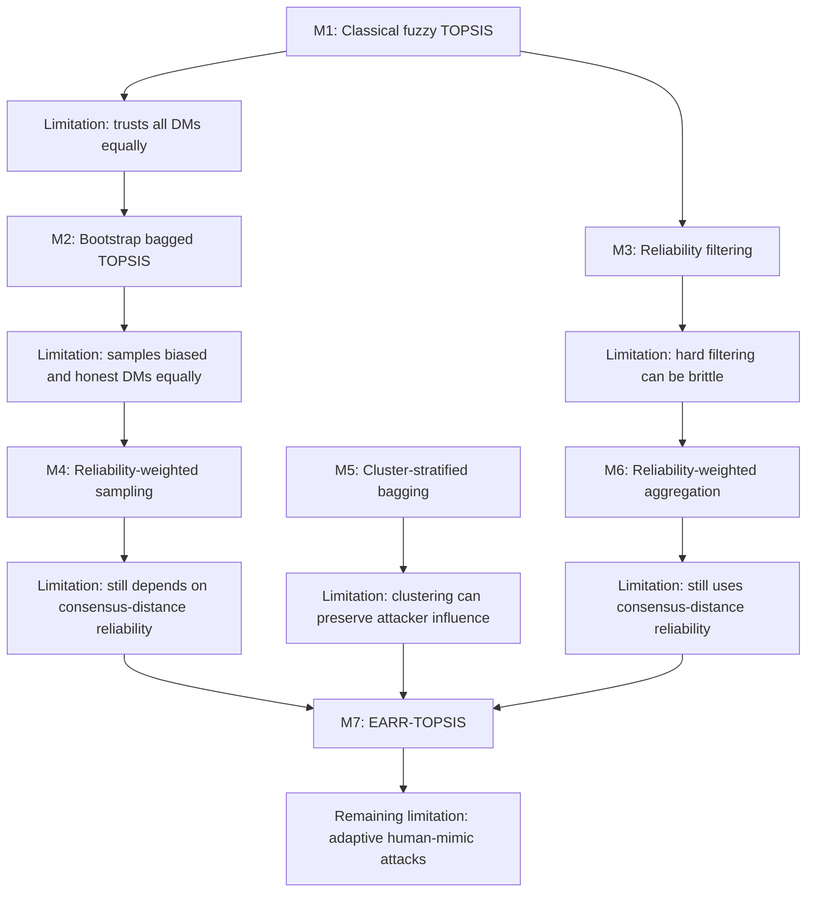

# Method Evolution and Limitations

This document explains why the thesis moved from M1 to M7, what limitation was found in each method, and how that limitation motivated the next design. Use this for thesis defense, dissertation writing, and journal-paper explanation.

## 1. Main Idea

The project did not start with M7 directly. It evolved step by step.

Each method answered one research question:

| Stage | Method | Question |
|---|---|---|
| Baseline | M1 | What happens if we use standard fuzzy TOPSIS under biased decision makers? |
| Ensemble baseline | M2 | Does bootstrap bagging alone solve the manipulation problem? |
| Filtering | M3 | Does removing unreliable/outlier decision makers help? |
| Proposed 1 | M4 | Does reliability-weighted sampling improve bagging? |
| Ablation | M5 | Does clustering decision makers improve robustness? |
| Proposed 2 | M6 | Does reliability-weighted fuzzy aggregation improve robustness? |
| Proposed final | M7 | Can multi-signal reliability handle stronger structured attacks? |

The final proposed methods are:

- M4: reliability-weighted bagging.
- M6: reliability-weighted fuzzy aggregation.
- M7: EARR-TOPSIS, the final entropy-aware robust method.

M1, M2, M3, and M5 are still important because they explain the development path and provide baselines/ablations.

## 2. Evolution Diagram

## 3. M1: Classical Fuzzy TOPSIS

### What M1 Does

M1 is the standard fuzzy TOPSIS baseline. It aggregates all decision makers into one group fuzzy decision matrix.

For decision maker \(D_k\), alternative \(A_i\), criterion \(C_j\):

\[
\tilde{x}_{ijk}=(l_{ijk},m_{ijk},u_{ijk})
\]

M1 aggregation:

\[
\tilde{x}_{ij}
=
\left(
\min_k l_{ijk},
\frac{1}{K}\sum_{k=1}^{K}m_{ijk},
\max_k u_{ijk}
\right)
\]

Then it runs standard fuzzy TOPSIS.

### Flaw Found

M1 assumes all decision makers are sincere and equally reliable.

This is the biggest weakness. If biased decision makers give:

- very high scores to a weak target,
- very low scores to competitors,

then the aggregated fuzzy matrix becomes contaminated.

### Why This Is Serious

The min/max aggregation can be especially sensitive to extreme values. A biased decision maker can affect the lower or upper envelope of the fuzzy rating.

### Evidence

In the focused real/pseudo-real contaminated tests:

| Dataset | Clean target rank | M1 contaminated target rank |
|---|---:|---:|
| Healthcare countries | 26 | 1 |
| Car evaluation | 300 | 24 |
| Healthcare allocation | 300 | 1 |

The attack target was originally weak, but M1 promoted it strongly.

### What This Motivated

This motivated M2:

> Maybe repeated resampling/bagging can reduce the influence of biased decision makers.

## 4. M2: Bootstrap Bagged Fuzzy TOPSIS

### What M2 Does

M2 creates many bootstrap bags of decision makers.

\[
S_b = \{D_{b1},D_{b2},...,D_{bK}\}
\]

Each \(D_{bt}\) is sampled uniformly with replacement.

Inside each bag, fuzzy TOPSIS is run, and bag outputs are aggregated.

### Flaw Found

M2 reduces instability, but it does not distinguish honest decision makers from biased decision makers.

Every decision maker has the same sampling probability:

\[
P(D_k)=\frac{1}{K}
\]

So biased decision makers still appear in many bags.

### Evidence

In the focused contaminated tests:

| Dataset | Clean target rank | M1 | M2 |
|---|---:|---:|---:|
| Healthcare countries | 26 | 1 | 7 |
| Car evaluation | 300 | 24 | 180 |
| Healthcare allocation | 300 | 1 | 52 |

M2 improved over M1, but it still failed to preserve the clean target rank.

Attack-fraction summary:

| Method | Blocked cases out of 18 |
|---|---:|
| M1 | 0 |
| M2 | 0 |

### What This Motivated

This motivated reliability-aware methods:

> Bagging alone is not enough. We need to estimate which decision makers are reliable.

## 5. M3: Reliability Filtering

### What M3 Does

M3 computes a reliability score for each decision maker based on distance from a median consensus vector.

Flatten each decision maker:

\[
\mathbf{z}_k=[l_{11k},m_{11k},u_{11k},...,l_{nmk},m_{nmk},u_{nmk}]^T
\]

Median center:

\[
\mathbf{c}=\operatorname{median}(\mathbf{z}_1,\mathbf{z}_2,...,\mathbf{z}_K)
\]

Distance:

\[
d_k=\|\mathbf{z}_k-\mathbf{c}\|_2
\]

Reliability:

\[
R_k=1-\frac{d_k}{\max_q d_q+\epsilon}
\]

M3 removes detected outlier decision makers, then runs fuzzy TOPSIS on the remaining group.

### Flaw Found

M3 uses hard filtering.

This has two risks:

1. It may remove legitimate minority experts.
2. It may fail when attackers are not obvious outliers.

### Why This Matters

In real group decision-making, disagreement is not always malicious. A decision maker can be different because they have valid expertise or a different risk view. A hard filter may be too aggressive.

### Evidence

M3 performed strongly in many structured contamination cases, but it failed when the contaminated group became large enough to shift the consensus structure.

Attack-fraction summary:

| Method | Blocked cases out of 18 |
|---|---:|
| M3 | 12 |

M3 is strong, but not final.

### What This Motivated

This motivated softer reliability methods:

- M4: do not remove decision makers; sample reliable ones more often.
- M6: do not remove decision makers; reduce suspicious decision makers' contribution during aggregation.

## 6. M4: Reliability-Weighted Bagging

### What M4 Does

M4 keeps bootstrap bagging but changes the sampling probability.

\[
P(D_k)=\frac{R_k+\epsilon}{\sum_{q=1}^{K}(R_q+\epsilon)}
\]

Reliable decision makers appear more often in bags. Suspicious decision makers appear less often.

### Why M4 Was Proposed

M4 is simple and explainable.

It improves M2 by adding reliability:

- M2: random bags.
- M4: reliability-weighted bags.

It also improves M3 by being softer:

- M3 removes decision makers.
- M4 keeps decision makers but reduces suspicious influence through lower sampling frequency.

### Limitation Found

M4 still depends on the consensus-distance reliability score.

If attackers become a majority, or if they shift the consensus center, the reliability signal can weaken.

### Evidence

M4 was strong through 40 percent effective structured contamination.

Attack-fraction summary:

| Method | Blocked cases out of 18 | Mean target error |
|---|---:|---:|
| M4 | 12 | 69.22 |

At majority structured contamination, M4 collapsed in several scenarios.

### What This Motivated

This motivated M7:

> We need a reliability model that does not depend only on distance from a consensus center.

## 7. M5: Cluster-Stratified Bagging

### What M5 Does

M5 clusters decision makers by rating behavior.

Cluster reliability:

\[
R_{G_g}=\frac{1}{|G_g|}\sum_{D_k\in G_g}R_k
\]

Low-reliability clusters may be excluded, and bags are sampled from retained clusters.

### Why M5 Was Tried

The idea was reasonable:

> If attackers behave similarly, they may form a separate cluster. Clustering may help isolate them.

### Flaw Found

M5 was inconsistent.

Main reasons:

1. Clustering depends heavily on dataset geometry.
2. Cluster boundaries can change sharply.
3. If an attacker cluster is retained, stratified sampling can preserve attacker influence.
4. If each cluster receives representation, contaminated groups may still enter every bag.

### Evidence

Focused contaminated tests:

| Dataset | Clean target rank | M4 | M5 |
|---|---:|---:|---:|
| Healthcare countries | 26 | 26 | 5 |
| Car evaluation | 300 | 300 | 192 |
| Healthcare allocation | 300 | 300 | 16 |

Attack-fraction summary:

| Method | Blocked cases out of 18 | Mean target error |
|---|---:|---:|
| M4 | 12 | 69.22 |
| M5 | 3 | 117.03 |

### Why M4 Was Chosen Over M5

M4 directly connects reliability with sampling probability. M5 depends on clustering, which can unintentionally preserve attacker influence.

Defense sentence:

> M5 was retained as an ablation because it tests whether cluster-aware sampling helps. However, the results show that M4 is simpler, more stable, and more effective. Therefore, M4 is proposed as a main method, while M5 is treated as an intermediate/ablation method.

### What This Motivated

M5 showed that clustering alone is not enough. This supported the move toward M7, where similarity/clone behavior is used as one reliability signal, not as the whole method.

## 8. M6: Reliability-Weighted Fuzzy Aggregation

### What M6 Does

M6 inserts reliability directly into fuzzy aggregation.

For each bag \(S_b\):

\[
\tilde{x}_{ij}^{rw}
=
\left(
\frac{\sum_{D_k\in S_b}\rho_k l_{ijk}}{\sum_{D_k\in S_b}\rho_k},
\frac{\sum_{D_k\in S_b}\rho_k m_{ijk}}{\sum_{D_k\in S_b}\rho_k},
\frac{\sum_{D_k\in S_b}\rho_k u_{ijk}}{\sum_{D_k\in S_b}\rho_k}
\right)
\]

This means all three fuzzy components are reliability-weighted.

### Why M6 Was Proposed

M4 controls who enters a bag. M6 controls how much each decision maker contributes after entering a bag.

This is stronger in principle:

- If a suspicious decision maker is sampled, M4 cannot reduce their rating inside that bag.
- M6 can reduce their rating contribution inside the aggregation.

### Limitation Found

M6 still uses the consensus-distance reliability engine, like M3 and M4.

So if attackers shift the consensus center, M6 can also fail.

### Evidence

M6 matched M4's strong behavior through 40 percent structured contamination.

Attack-fraction summary:

| Method | Blocked cases out of 18 | Mean target error |
|---|---:|---:|
| M6 | 12 | 69.22 |

### What This Motivated

This motivated M7:

> Reliability should be estimated from multiple signals, not only distance from consensus.

## 9. M7: EARR-TOPSIS

### What M7 Does

M7 is the final method.

It uses three reliability signals:

1. Entropy reliability.
2. Variance-consistency reliability.
3. Clone/agreement reliability.

Composite reliability:

\[
\rho_k=0.35R_k^{(H)}+0.35R_k^{(V)}+0.30R_k^{(C)}
\]

Then it applies:

1. Gap-based filtering.
2. Reliability-weighted sampling.
3. Reliability-weighted fuzzy aggregation.
4. Bag-quality weighting.

### What M7 Fixes

M7 addresses limitations of earlier methods:

| Earlier Method | Limitation | How M7 Responds |
|---|---|---|
| M1 | Trusts all decision makers equally | Adds reliability estimation |
| M2 | Samples biased and honest DMs equally | Uses reliability-weighted sampling |
| M3 | Hard filtering is brittle | Uses soft reliability plus conservative gap filtering |
| M4 | Depends on consensus-distance reliability | Uses entropy, variance, clone/agreement signals |
| M5 | Clustering is unstable | Uses clone/agreement as one signal instead of full clustering dependence |
| M6 | Uses consensus-distance reliability | Replaces it with multi-signal reliability |

### Remaining Limitation

M7 is not universally robust.

It can fail against adaptive human-mimic attackers who intentionally make biased ratings look statistically similar to honest human ratings.

Defense sentence:

> M7 is designed for structured, statistically distinguishable coordinated manipulation. It is not claimed to solve every form of human bias or every adaptive attack.

## 10. Older Variant Files and Why They Exist

The directory contains some older variants. These were used during research exploration.

| File | Purpose | Final paper role |
|---|---|---|
| `m5_disjoint.py` | Tested disjoint, non-bootstrap partitioning for M5 | Historical experiment |
| `m6_disjoint.py` | Tested disjoint, non-bootstrap partitioning for M6 | Historical experiment |
| `test_disjoint_layer3.py` | Compared original bootstrap variants against disjoint variants | Development test |
| `test_m7_ablation.py` | Tested which M7 signals matter | Ablation/stress test |
| `test_m7_supermajority.py` | Tested M7 against larger structured attacker groups | Stress test |
| `test_m7_adversarial.py` | Tested human-mimic/adaptive attacks | Limitation evidence |
| `m7_theorems.md` | Theory notes for M7 behavior | Notes, not final method code |

Final official files:

| Method | Final file |
|---|---|
| M5 | `m5_cluster_stratified.py` |
| M6 | `m6_reliability_weighted.py` |
| M7 | `m7_entropy_reliability.py` |

## 11. External Baseline Limitations

External comparators were also tested.

| Baseline | Limitation Found |
|---|---|
| Median TOPSIS | Helps at low contamination but collapses when contaminated group shifts the median. |
| Trimmed-Mean TOPSIS | Can remove extremes, but structured attacks can still move the aggregate. |
| MAD-Consensus TOPSIS | Strong through moderate contamination, but fails at majority contamination. |
| Individual-Borda TOPSIS | Aggregates individual ranks but does not detect malicious decision makers. |
| Huang-Li Group-Ideal TOPSIS adaptation | Important prior-art comparator, but not designed for adversarial reliability detection. |

External baseline evidence:

| Method | Blocked cases out of 18 | Mean target error |
|---|---:|---:|
| Median TOPSIS | 8 | 71.11 |
| Trimmed-Mean TOPSIS | 6 | 106.44 |
| MAD-Consensus TOPSIS | 12 | 69.22 |
| Individual-Borda TOPSIS | 0 | 66.94 |
| Huang-Li Group-Ideal TOPSIS | 0 | 188.22 |
| M7 | 18 | 0.00 |

## 12. Final Defense Explanation

If asked:

> Why did you need so many methods?

Answer:

> The methods were developed as a controlled progression. M1 establishes the classical vulnerable baseline. M2 tests whether bagging alone helps. M3 tests whether reliability filtering helps. M4 improves bagging by sampling reliable decision makers more often. M5 tests whether clustering helps, but the results show it is inconsistent. M6 directly inserts reliability into fuzzy aggregation. Finally, M7 combines multiple reliability signals and uses reliability at sampling, aggregation, and ensemble-weighting stages. Each method exposes a limitation that motivates the next method.

If asked:

> Which methods are final?

Answer:

> The final proposed methods are M4, M6, and M7. M1 and M2 are baselines, M3 is an intermediate reliability method, and M5 is an ablation branch.

If asked:

> Why is M7 the final method?

Answer:

> Because it addresses the main weakness of M3, M4, and M6: reliance on consensus-distance reliability. M7 avoids using consensus-centroid distance in the composite score and instead uses entropy, variance-consistency, and clone/agreement behavior. It then applies reliability during sampling, aggregation, and bag weighting.

## 13. Short Version To Memorize

M1 failed because it trusts everyone equally.

M2 helped but failed because it samples biased and honest decision makers equally.

M3 helped but is brittle because it removes decision makers.

M4 is proposed because it softly samples reliable decision makers more often.

M5 was tried because attackers may cluster, but it was inconsistent and blocked only 3/18 cases.

M6 is proposed because it directly reduces suspicious decision makers' contribution in fuzzy aggregation.

M7 is proposed as the final method because it uses multiple reliability signals and applies reliability at multiple stages.

