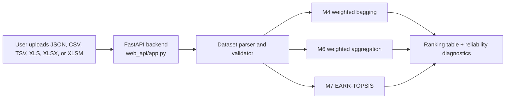

# EARR-TOPSIS: Bias-Resistant Fuzzy TOPSIS

This repository contains the implementation, benchmark evidence, and public API for **Entropy-Aware Reliability-Weighted Robust Fuzzy TOPSIS (EARR-TOPSIS)**.

The project studies how fuzzy TOPSIS behaves when some decision makers provide coordinated biased ratings. The final public system exposes the three proposed methods:

| Proposed method | Code | Main idea |
|---|---|---|
| Method 1 | `m4_weighted_bagging.py` | Reliability-weighted bootstrap bagging |
| Method 2 | `m6_reliability_weighted.py` | Reliability-weighted fuzzy aggregation inside each bag |
| Method 3 | `m7_entropy_reliability.py` | EARR-TOPSIS: entropy, variance-consistency, and clone/agreement reliability |

The live app is intended to run on **Hugging Face Spaces** because it needs a Python backend. GitHub is used as the public research/code repository.

## Public System Architecture



## Method Diagrams

### M4: Reliability-Weighted Bagging


### M6: Reliability-Weighted Fuzzy Aggregation


### M7: EARR-TOPSIS


## Key Result Summary

The core attack model chooses the clean lowest-ranked target alternative and lets a fraction of decision makers promote it. Target rank is the main robustness metric. Higher target rank is better because the attack target should remain near its original low position.

### Focused Real/Pseudo-Real Benchmarks

These were rerun with 30 repeats and 200 bags on the larger publication-facing datasets.

| Dataset | Alternatives | Attack target | Clean target rank | M1 | M2 | M3 | M4 | M5 | M6 | M7 |
|---|---:|---|---:|---:|---:|---:|---:|---:|---:|---:|
| healthcare_countries_2021 | 26 | Romania | 26 | 1 | 7 | 26 | 26 | 5 | 26 | 26 |
| car_evaluation | 300 | Car_1_unacc | 300 | 24 | 180 | 300 | 300 | 192 | 300 | 300 |
| healthcare_resource_allocation | 300 | Hengshui_2008 | 300 | 1 | 52 | 300 | 300 | 16 | 300 | 300 |

Interpretation:

- Standard fuzzy TOPSIS (`M1`) is strongly vulnerable to targeted contamination.
- Corrected bootstrap bagging (`M2`) improves the result but does not reliably block the attack.
- `M4`, `M6`, and `M7` preserve the target rank in these 30% contamination runs.
- `M5` is inconsistent and is treated as an intermediate/ablation method, not one of the three final proposed methods.

### Attack-Fraction Curve Results

The attack-fraction curve evaluates 10% to 60% requested attacker fractions on three datasets. Values below are the contaminated target ranks.

| Dataset | Effective attack | Clean target rank | M1 | M2 | M3 | M4 | M5 | M6 | M7 |
|---|---:|---:|---:|---:|---:|---:|---:|---:|---:|
| healthcare_countries_2021 | 13.3% | 26 | 1 | 18 | 26 | 26 | 19 | 26 | 26 |
| healthcare_countries_2021 | 20.0% | 26 | 1 | 11 | 26 | 26 | 11 | 26 | 26 |
| healthcare_countries_2021 | 26.7% | 26 | 1 | 7 | 26 | 26 | 5 | 26 | 26 |
| healthcare_countries_2021 | 40.0% | 26 | 1 | 2 | 26 | 26 | 26 | 26 | 26 |
| healthcare_countries_2021 | 53.3% | 26 | 1 | 1 | 1 | 1 | 1 | 1 | 26 |
| healthcare_countries_2021 | 60.0% | 26 | 1 | 1 | 1 | 1 | 1 | 1 | 26 |
| car_evaluation | 13.3% | 300 | 78 | 272 | 300 | 300 | 289 | 300 | 300 |
| car_evaluation | 20.0% | 300 | 48 | 230 | 300 | 300 | 258 | 300 | 300 |
| car_evaluation | 26.7% | 300 | 24 | 180 | 300 | 300 | 192 | 300 | 300 |
| car_evaluation | 40.0% | 300 | 1 | 77 | 300 | 300 | 300 | 300 | 300 |
| car_evaluation | 53.3% | 300 | 1 | 18 | 1 | 1 | 1 | 1 | 300 |
| car_evaluation | 60.0% | 300 | 1 | 8 | 1 | 1 | 1 | 1 | 300 |
| healthcare_resource_allocation | 13.3% | 300 | 3 | 168 | 300 | 300 | 166 | 300 | 300 |
| healthcare_resource_allocation | 20.0% | 300 | 1 | 101 | 300 | 300 | 62 | 300 | 300 |
| healthcare_resource_allocation | 26.7% | 300 | 1 | 52 | 300 | 300 | 16 | 300 | 300 |
| healthcare_resource_allocation | 40.0% | 300 | 1 | 11 | 300 | 300 | 300 | 300 | 300 |
| healthcare_resource_allocation | 53.3% | 300 | 1 | 1 | 1 | 1 | 1 | 1 | 300 |
| healthcare_resource_allocation | 60.0% | 300 | 1 | 1 | 1 | 1 | 1 | 1 | 300 |

Interpretation:

- `M4` and `M6` are strong up to 40% effective structured contamination.
- `M7` preserves the clean target rank in all 18 tested attack-fraction scenarios, including the majority-attack cases.
- This claim is bounded to structured attacks that leave statistically distinguishable reliability patterns.

### Method-Level Statistical Summary

This table summarizes target-rank error across the 18 attack-fraction scenarios. Lower error is better. A blocked case means the attack target stayed at its clean rank.

| Method | Cases | Blocked cases | Blocked rate | Mean target-rank error | Max target-rank error |
|---|---:|---:|---:|---:|---:|
| EB1 Median TOPSIS | 18 | 8 | 0.444 | 71.111 | 299 |
| EB2 Trimmed Mean TOPSIS | 18 | 6 | 0.333 | 106.444 | 299 |
| EB3 MAD Consensus TOPSIS | 18 | 12 | 0.667 | 69.222 | 299 |
| EB4 Individual Borda TOPSIS | 18 | 0 | 0.000 | 66.944 | 215 |
| EB5 Huang-Li Group-Ideal TOPSIS | 18 | 0 | 0.000 | 188.222 | 297 |
| M1 Normal Fuzzy TOPSIS | 18 | 0 | 0.000 | 199.389 | 299 |
| M2 Bootstrap Bagged TOPSIS | 18 | 0 | 0.000 | 144.946 | 299 |
| M3 Reliability Filtered TOPSIS | 18 | 12 | 0.667 | 69.222 | 299 |
| M4 Reliability-Weighted Bagging | 18 | 12 | 0.667 | 69.222 | 299 |
| M5 Cluster/Stratified Intermediate | 18 | 3 | 0.167 | 117.032 | 299 |
| M6 Reliability-Weighted Aggregation | 18 | 12 | 0.667 | 69.222 | 299 |
| M7 EARR-TOPSIS | 18 | 18 | 1.000 | 0.000 | 0 |

### Pairwise Target-Error Tests For M7

Positive cases mean M7 had lower target-rank error than the comparator on the same dataset/fraction scenario.

| Comparison | Cases | M7 better | M7 worse | Ties | Sign-test p | Wilcoxon p |
|---|---:|---:|---:|---:|---:|---:|
| M7 vs M1 | 18 | 18 | 0 | 0 | 0.000008 | 0.000214 |
| M7 vs M2 | 18 | 18 | 0 | 0 | 0.000008 | 0.000214 |
| M7 vs M4 | 18 | 6 | 0 | 12 | 0.031250 | 0.036032 |
| M7 vs M6 | 18 | 6 | 0 | 12 | 0.031250 | 0.036032 |
| M7 vs EB1 Median TOPSIS | 18 | 10 | 0 | 8 | 0.001953 | 0.005922 |
| M7 vs EB2 Trimmed Mean TOPSIS | 18 | 12 | 0 | 6 | 0.000488 | 0.002526 |
| M7 vs EB4 Individual Borda TOPSIS | 18 | 18 | 0 | 0 | 0.000008 | 0.000214 |

### Runtime Snapshot

Representative one-run runtimes at 30% contamination with 200 bags.

| Dataset | Alternatives | Criteria | M4 seconds | M6 seconds | M7 seconds |
|---|---:|---:|---:|---:|---:|
| healthcare_countries_2021 | 26 | 13 | 0.387 | 0.291 | 0.315 |
| car_evaluation | 300 | 6 | 2.226 | 1.728 | 1.818 |
| healthcare_resource_allocation | 300 | 18 | 6.863 | 5.468 | 5.731 |

Full evidence files are in `outputs/final_evidence/`.

## Public Demo Output Example

The web app includes an **M7 Stress Example**. In that example, a coordinated block pushes Romania upward in the healthcare dataset.

| Method | Top result in stress example | Interpretation |
|---|---|---|
| M4 | Romania | Attack succeeds against majority-dependent reliability |
| M6 | Romania | Attack succeeds against majority-dependent reliability |
| M7 | Austria | Attack is suppressed by entropy/variance/clone reliability |

This example is included at `web_api/static/examples/m7_stress_healthcare_50pct.json`.

## Supported Upload Formats

The API supports:

- Native fuzzy TOPSIS JSON
- Flat fuzzy CSV/TSV/Excel tables with `decision_maker, alternative, criterion, l, m, u`
- Crisp CSV/TSV/Excel matrices, converted into deterministic pseudo-fuzzy panels
- The thesis supplier hesitant-fuzzy Excel layout with a `Julgamentos DMs` sheet

Supported file extensions:

```text
.json, .csv, .tsv, .xls, .xlsx, .xlsm
```

Unsupported:

- scanned PDFs
- images
- lookup-only spreadsheets with no criteria
- unstructured workbooks where alternatives and criteria cannot be inferred

## Run Locally

```bash
python -m venv .venv
source .venv/bin/activate
pip install -r web_api/requirements.txt
python -m uvicorn web_api.app:app --host 127.0.0.1 --port 8000 --reload
```

Open:

```text
http://127.0.0.1:8000
```

Health check:

```bash
curl http://127.0.0.1:8000/health
```

Expected:

```json
{"status":"ok","service":"EARR-TOPSIS API","version":"0.2.0"}
```

## API Endpoints

| Endpoint | Purpose |
|---|---|
| `GET /` | Upload dashboard |
| `GET /health` | Service health check |
| `GET /api/methods` | Method metadata |
| `GET /api/schema` | Upload schema guide |
| `GET /api/example` | Example dataset |
| `POST /api/validate` | Validate an uploaded dataset |
| `POST /api/run` | Run M4, M6, and/or M7 |

Example:

```bash
curl -X POST http://127.0.0.1:8000/api/run \
  -F "file=@web_api/examples/example_native.json" \
  -F "methods=M4,M6,M7" \
  -F "num_bags=100" \
  -F "seed=42" \
  -F "top_k=25"
```

## Deploy The Live App

Use Hugging Face Spaces with:

```text
SDK: Docker
Hardware: CPU Basic
```

The included `Dockerfile` starts:

```bash
uvicorn web_api.app:app --host 0.0.0.0 --port 7860
```

Detailed deployment steps are in `HUGGINGFACE_SPACES_DEPLOYMENT.md`.

## Repository Map

| Path | Purpose |
|---|---|
| `web_api/` | FastAPI backend and animated upload UI |
| `m1_normal_topsis.py` | Standard fuzzy TOPSIS baseline |
| `m2_bagged_topsis.py` | Corrected bootstrap bagged TOPSIS baseline |
| `m3_ml_filtered.py` | Reliability-filtered intermediate method |
| `m4_weighted_bagging.py` | Final proposed Method 1 |
| `m5_cluster_stratified.py` | Intermediate/ablation method |
| `m6_reliability_weighted.py` | Final proposed Method 2 |
| `m7_entropy_reliability.py` | Final proposed Method 3, EARR-TOPSIS |
| `reliability.py` | Shared reliability scoring helpers |
| `external_baselines.py` | Prior-art-inspired comparator baselines |
| `run_real_dataset_benchmarks.py` | Real/pseudo-real benchmark runner |
| `run_attack_fraction_curves.py` | Attack-fraction experiment runner |
| `run_external_baselines.py` | External baseline runner |
| `run_runtime_scalability.py` | Runtime/scalability runner |
| `compile_final_evidence.py` | Evidence table compiler |
| `diagrams/` | Method diagrams used in this README |
| `outputs/final_evidence/` | Frozen benchmark tables for thesis/paper writing |

## Reproducibility Notes

The public repository intentionally excludes raw datasets, paper PDFs, dissertation drafts, preview images, and personal review notes. The final benchmark summaries are kept in `outputs/final_evidence/` so the repository remains readable and lightweight.

## Claim Boundary

M7 is robust in the tested threat model: structured coordinated manipulation that leaves distinguishable entropy, variance, or clone/agreement patterns.

M7 is **not** claimed to solve all human bias or fully adaptive human-mimic adversaries. A careful paper should state this as a limitation, not hide it.

## License

This repository currently uses the Apache-2.0 license.
