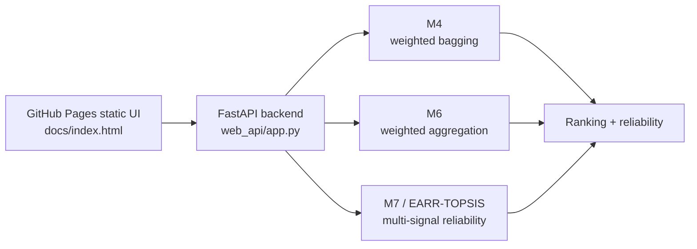
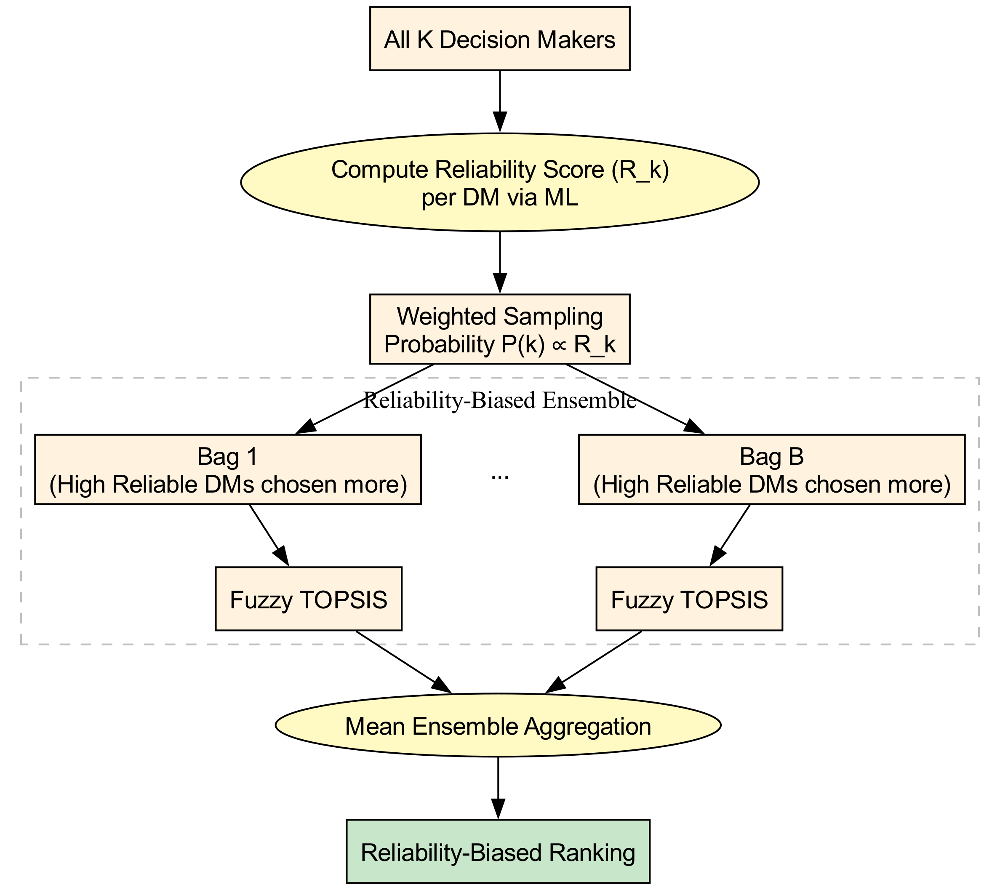
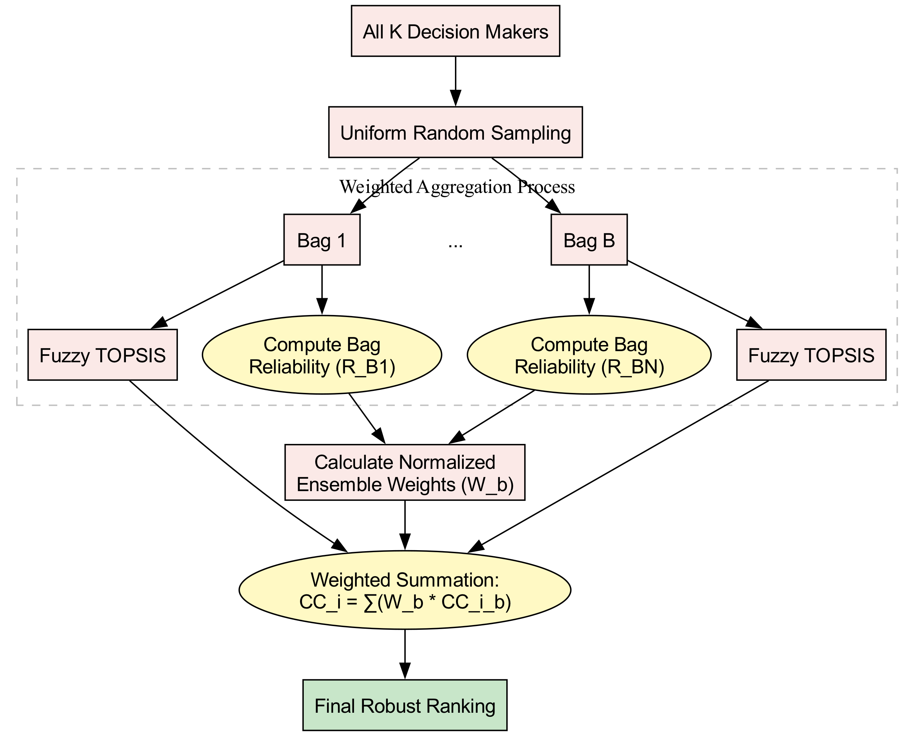
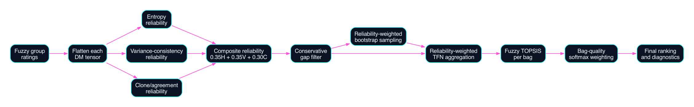

# EARR-TOPSIS: Bias-Resistant Fuzzy TOPSIS Lab

This repository contains the thesis implementation for **Entropy-Aware Reliability-Weighted Robust Fuzzy TOPSIS** and a public demo/API for the three proposed methods:

| Method | Public role | Core idea |
|---|---|---|
| M4 | Proposed Method 1 | Reliability-weighted bootstrap bagging |
| M6 | Proposed Method 2 | Reliability-weighted fuzzy aggregation |
| M7 / EARR-TOPSIS | Proposed Method 3 | Entropy, variance-consistency, and clone/agreement reliability with weighted ensemble aggregation |

The public interface is designed for uploading fuzzy TOPSIS datasets, running M4/M6/M7 separately, and inspecting rankings plus decision-maker reliability diagnostics.

## Demo Architecture



GitHub Pages can host the animated static UI. It cannot run Python, so the FastAPI backend must be run locally or deployed to a Python host such as Render, Railway, Hugging Face Spaces, or a university server.

## Method Diagrams

### M4: Reliability-Weighted Bagging



### M6: Reliability-Weighted Fuzzy Aggregation



### M7: EARR-TOPSIS



## Run Locally

From the repository root:

```bash
python -m venv .venv
source .venv/bin/activate
pip install -r web_api/requirements.txt
python -m uvicorn web_api.app:app --host 127.0.0.1 --port 8000 --reload
```

Open:

```text
http://127.0.0.1:8000
```

The same UI is also copied to `docs/index.html` for GitHub Pages.

## API Endpoints

| Endpoint | Purpose |
|---|---|
| `GET /` | Animated upload dashboard |
| `GET /health` | Service health check |
| `GET /api/methods` | Method metadata for M4, M6, and M7 |
| `GET /api/schema` | Upload schema guide |
| `GET /api/example` | Small native JSON example |
| `POST /api/validate` | Validate and summarize an uploaded dataset |
| `POST /api/run` | Run selected methods and return rankings/reliability |

Example:

```bash
curl -X POST http://127.0.0.1:8000/api/run \
  -F "file=@web_api/examples/example_native.json" \
  -F "methods=M4,M6,M7" \
  -F "num_bags=100" \
  -F "seed=42" \
  -F "top_k=25"
```

## Supported Upload Formats

### 1. Native fuzzy TOPSIS JSON

```json
{
  "alternatives": ["A1", "A2"],
  "criteria": ["C1", "C2"],
  "decision_makers": ["DM1", "DM2"],
  "criteria_weights": {"C1": [1, 1, 1], "C2": [1, 1, 1]},
  "criteria_types": {"C1": "benefit", "C2": "cost"},
  "ratings": {
    "DM1": {"A1": {"C1": [6, 7, 8], "C2": [3, 4, 5]}}
  }
}
```

### 2. Flat fuzzy CSV/XLSX

Required columns:

```text
decision_maker,alternative,criterion,l,m,u
```

Optional columns:

```text
weight_l,weight_m,weight_u,criteria_type
```

### 3. Crisp CSV/XLSX matrix

The first text column is treated as the alternative name. Numeric columns are treated as criteria. For demonstration, the API converts the crisp matrix into a deterministic pseudo-fuzzy group panel.

```csv
alternative,quality,cost,speed
A1,80,40,70
A2,75,30,80
```

For crisp uploads, list cost criteria in the UI or form field:

```text
cost,price,risk,delay
```

Large crisp workbooks can be limited with the `max_alternatives` form field. The UI defaults to 300 alternatives so a public demo does not accidentally run a very large workbook with hundreds of bags.

### 4. Supplier hesitant-fuzzy Excel workbooks

The backend also recognizes the supplier-selection Excel workbooks used in the thesis experiments when they contain a `Julgamentos DMs` sheet. It extracts the decision-maker blocks and parses hesitant linguistic values such as `[s4]` or `[s3,s4]` into triangular fuzzy numbers.

Lookup-only spreadsheets such as `country_names.xlsx` are intentionally rejected because they do not contain numeric criteria or fuzzy ratings to rank.

## GitHub Pages

1. Push this repository to GitHub.
2. Go to repository **Settings > Pages**.
3. Set source to the `main` branch and `/docs` folder.
4. Open the generated `https://<username>.github.io/<repo>/` URL.
5. Enter the deployed FastAPI backend URL in the UI's **API endpoint** box.

The page is static and will still render without the API, but uploads require a running backend.

## Evidence and Thesis Tables

The final frozen evidence package is in:

- `outputs/final_evidence/final_evidence_report.md`
- `outputs/final_evidence/attack_fraction_target_rank_wide.csv`
- `outputs/final_evidence/method_target_error_summary.csv`
- `outputs/final_evidence/m7_pairwise_target_error_tests.csv`
- `outputs/final_evidence/runtime_scalability.csv`

The dissertation result claim is intentionally bounded:

> M4 and M6 preserve the clean target rank through 40% effective structured contamination, while M7 preserves the clean target rank across all 18 tested structured attack-fraction scenarios up to 60% effective contamination.

M7 is **not** claimed to solve all human bias or fully adaptive human-mimic attacks.

## Repository Map

| Path | Purpose |
|---|---|
| `m4_weighted_bagging.py` | Final M4 implementation |
| `m6_reliability_weighted.py` | Final M6 implementation |
| `m7_entropy_reliability.py` | Final M7/EARR-TOPSIS implementation |
| `web_api/app.py` | FastAPI backend |
| `web_api/static/index.html` | Local served UI |
| `docs/index.html` | GitHub Pages static UI |
| `web_api/examples/` | Upload examples |
| `diagrams/` | Method architecture diagrams |
| `outputs/final_evidence/` | Frozen result tables |

## Deployment Note

This is a research decision-support prototype. Production deployment should add authentication, upload-size limits, file-type scanning, rate limits, logging, secure deletion of temporary files, and a permanent reproducibility report store.
