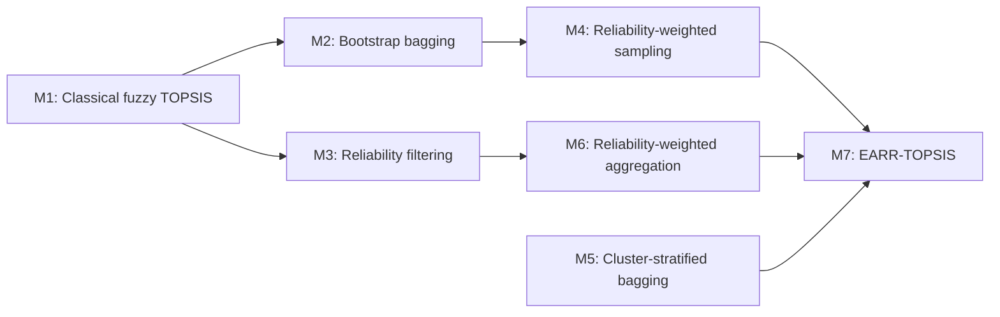
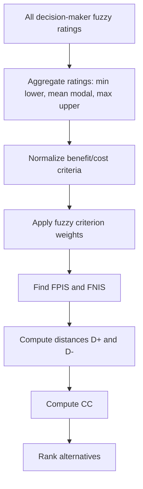
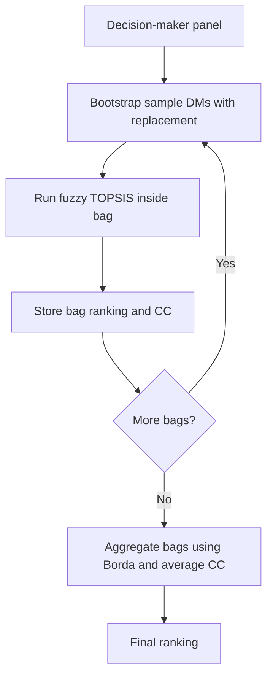
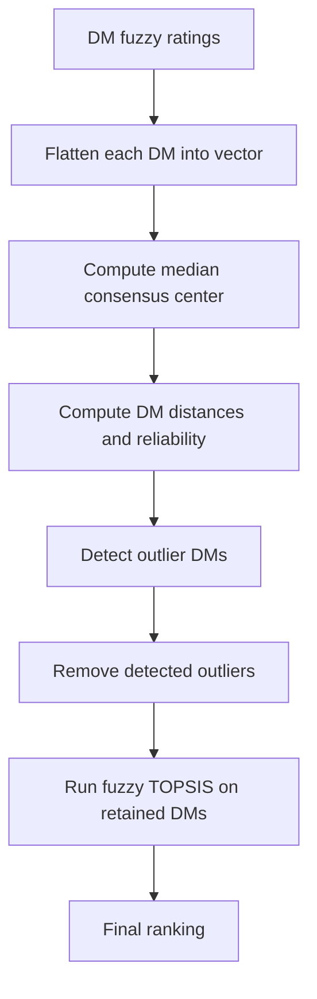
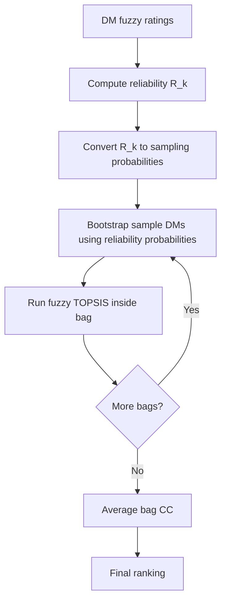
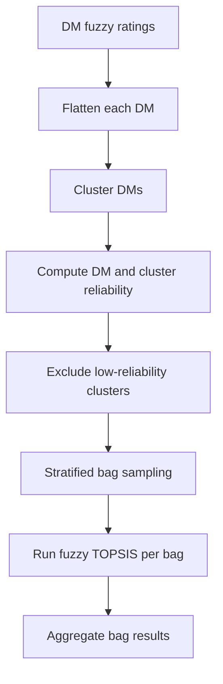
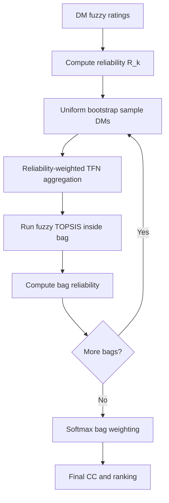
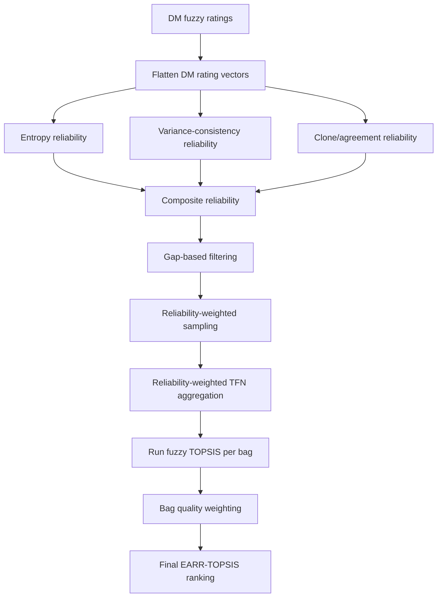

# Thesis Defense Study Guide: EARR-TOPSIS

This guide is written so you can defend the work in your own words. It explains what you built, why each method exists, what tests were run, what results mean, and what limitations you should state honestly.

## 1. One-Minute Explanation

The thesis studies a weakness in fuzzy TOPSIS group decision-making. Classical fuzzy TOPSIS assumes all decision makers are sincere and equally reliable. If a small or coordinated group gives biased ratings, they can promote a weak alternative and distort the final ranking.

The research builds a progression of seven methods:

- M1: normal fuzzy TOPSIS baseline.
- M2: bootstrap-bagged fuzzy TOPSIS baseline.
- M3: reliability-filtered TOPSIS.
- M4: reliability-weighted bagging.
- M5: cluster-stratified bagging.
- M6: reliability-weighted fuzzy aggregation.
- M7: entropy-aware reliability-weighted robust fuzzy TOPSIS, called EARR-TOPSIS.

The final proposed methods are M4, M6, and M7. M4 uses reliability to sample better decision makers more often. M6 uses reliability inside fuzzy aggregation. M7 uses entropy, variance consistency, clone/agreement detection, gap filtering, reliability-weighted sampling, reliability-weighted aggregation, and bag-quality weighting.

The main finding is that M1 and M2 are vulnerable to structured coordinated bias. M4 and M6 resist structured contamination through 40 percent effective contamination. M7 preserves the clean target rank in all 18 tested attack-fraction scenarios up to 60 percent effective structured contamination.

## 2. Problem In Simple Terms

Imagine several experts score alternatives. In a clean setting, experts may disagree, but they are mostly sincere.

Now imagine some experts want one weak alternative to win. They give:

- very high scores to the weak target,
- very low scores to all competitors.

Classical fuzzy TOPSIS averages or aggregates all decision makers, so those biased scores can move the target upward.

Your thesis asks:

> Can fuzzy TOPSIS be made more robust if we estimate how reliable each decision maker appears from their rating behavior?

## 3. Core Fuzzy TOPSIS Concepts

### 3.1 Triangular Fuzzy Number

Each rating is a triangular fuzzy number:

\[
\tilde{x} = (l,m,u)
\]

where:

- \(l\): lower or conservative score,
- \(m\): modal or most likely score,
- \(u\): upper or optimistic score.

Example:

\[
(5,6,7)
\]

means the decision maker thinks the score is around 6, but realistically between 5 and 7.

### 3.2 TOPSIS Idea

TOPSIS ranks alternatives using two ideal points:

- FPIS: fuzzy positive ideal solution, the best possible direction.
- FNIS: fuzzy negative ideal solution, the worst possible direction.

An alternative is better when it is:

- close to FPIS,
- far from FNIS.

Closeness coefficient:

\[
CC_i = \frac{D_i^-}{D_i^+ + D_i^-}
\]

where:

- \(D_i^+\): distance from positive ideal,
- \(D_i^-\): distance from negative ideal.

Higher \(CC_i\) means better rank.

### 3.3 Vertex Distance

Distance between two triangular fuzzy numbers:

\[
d(\tilde{a},\tilde{b}) =
\sqrt{
\frac{
(a_l-b_l)^2+(a_m-b_m)^2+(a_u-b_u)^2
}{3}
}
\]

This is like Euclidean distance over the three fuzzy components.

## 4. Overall Method Progression

The logic is progressive:

- M1 shows the vulnerability.
- M2 checks whether bagging alone solves the problem.
- M3 checks whether filtering suspicious decision makers helps.
- M4 improves bagging using reliability-aware sampling.
- M5 checks whether clustering decision makers helps.
- M6 inserts reliability directly into fuzzy aggregation.
- M7 combines the strongest ideas and adds entropy/variance/clone signals.

## 5. Method M1: Classical Fuzzy TOPSIS

### 5.1 What M1 Does

M1 is the baseline. It takes all decision makers and aggregates their fuzzy ratings.

For each alternative \(A_i\), criterion \(C_j\), and decision maker \(D_k\):

\[
\tilde{x}_{ijk} = (l_{ijk},m_{ijk},u_{ijk})
\]

M1 aggregation:

\[
\tilde{x}_{ij}
=
\left(
\min_k l_{ijk},
\frac{1}{K}\sum_{k=1}^{K}m_{ijk},
\max_k u_{ijk}
\right)
\]

Then it normalizes, applies weights, finds FPIS/FNIS, computes distances, and ranks alternatives by closeness coefficient.

### 5.2 Diagram

Image in project:

### 5.3 Strength

Simple, standard, explainable.

### 5.4 Weakness

It trusts all decision makers. If biased DMs give extreme ratings, they directly affect the aggregate matrix.

### 5.5 Defense Sentence

> M1 is included as the classical baseline. It shows what happens when fuzzy TOPSIS is used without any reliability mechanism.

## 6. Method M2: Bootstrap Bagged Fuzzy TOPSIS

### 6.1 What M2 Does

M2 uses bootstrap sampling. Instead of running TOPSIS once on all DMs, it creates many bags.

For each bag:

\[
S_b = \{D_{b1},D_{b2},...,D_{bK}\}
\]

where each \(D_{bt}\) is sampled uniformly with replacement from the original DMs.

Inside each bag, component-wise mean aggregation is used:

\[
\tilde{x}_{ij}^{(b)}
=
\left(
\frac{1}{|S_b|}\sum_{D_k\in S_b}l_{ijk},
\frac{1}{|S_b|}\sum_{D_k\in S_b}m_{ijk},
\frac{1}{|S_b|}\sum_{D_k\in S_b}u_{ijk}
\right)
\]

Each bag produces a ranking. The final ranking uses Borda-style rank aggregation and average closeness coefficient.

### 6.2 Diagram

Image in project:

### 6.3 Strength

Reduces instability compared with one direct run.

### 6.4 Weakness

It samples honest and biased DMs equally. If biased DMs are present, they still appear in many bags.

### 6.5 Defense Sentence

> M2 tests whether ensemble resampling alone is enough. The results show it helps compared with M1, but it does not reliably block targeted manipulation.

## 7. Shared Reliability Engine for M3, M4, M5, M6

M3 through M6 use a consensus-distance reliability idea.

### 7.1 Flatten Decision Maker Ratings

Each decision maker's full rating tensor becomes a vector:

\[
\mathbf{z}_k =
[l_{11k},m_{11k},u_{11k},...,l_{nmk},m_{nmk},u_{nmk}]^T
\]

### 7.2 Median Consensus Center

\[
\mathbf{c} =
\operatorname{median}(\mathbf{z}_1,\mathbf{z}_2,...,\mathbf{z}_K)
\]

### 7.3 Distance From Consensus

\[
d_k = \|\mathbf{z}_k-\mathbf{c}\|_2
\]

### 7.4 Reliability Score

\[
R_k = 1-\frac{d_k}{\max_q d_q+\epsilon}
\]

If a DM is close to the group center, reliability is high. If far from the center, reliability is low.

### 7.5 Main Limitation

If attackers are a minority and behave differently, this works well. If attackers become a majority, they can shift the consensus structure.

## 8. Method M3: Reliability Filtering

### 8.1 What M3 Does

M3 computes reliability and removes decision makers detected as outliers. Then it runs fuzzy TOPSIS on the retained DMs.

### 8.2 Diagram

### 8.3 Strength

Very effective when biased DMs are obvious outliers.

### 8.4 Weakness

Hard filtering can remove legitimate minority experts. It also fails when attackers are not clear outliers.

### 8.5 Defense Sentence

> M3 is an intermediate method. It shows that reliability estimation helps, but hard filtering is too brittle to be the final contribution.

## 9. Method M4: Reliability-Weighted Bagging

### 9.1 What M4 Does

M4 keeps M2's bootstrap structure, but changes the sampling probabilities.

Instead of uniform sampling:

\[
P(D_k) = \frac{R_k+\epsilon}{\sum_{q=1}^{K}(R_q+\epsilon)}
\]

Reliable DMs are sampled more often. Suspicious DMs are sampled less often.

### 9.2 Diagram

Image in project:

### 9.3 Strength

Simple and explainable. It is the first strong proposed method.

### 9.4 Weakness

It depends on consensus-distance reliability. If that reliability score is hijacked, M4 weakens.

### 9.5 Defense Sentence

> M4 answers whether bagging becomes more robust when reliable decision makers are sampled more frequently. It performs strongly through moderate structured contamination.

## 10. Method M5: Cluster-Stratified Bagging

### 10.1 What M5 Does

M5 clusters decision makers based on their flattened rating vectors. It tries to identify groups of similar DMs.

Cluster reliability:

\[
R_{G_g} = \frac{1}{|G_g|}\sum_{D_k\in G_g} R_k
\]

Low-reliability clusters may be excluded. Bags are sampled from retained clusters.

### 10.2 Diagram

Image in project:

### 10.3 Strength

Useful if attackers form a clear cluster.

### 10.4 Weakness

Clustering can be unstable. Sometimes it preserves attacker influence.

### 10.5 Defense Sentence

> M5 is not one of the final proposed methods. It is an ablation showing that clustering alone is not reliable enough.

## 11. Method M6: Reliability-Weighted Fuzzy Aggregation

### 11.1 What M6 Does

M6 uses reliability inside fuzzy aggregation itself.

For a bag \(S_b\):

\[
\tilde{x}_{ij}^{rw}
=
\left(
\frac{\sum_{D_k\in S_b}\rho_k l_{ijk}}{\sum_{D_k\in S_b}\rho_k},
\frac{\sum_{D_k\in S_b}\rho_k m_{ijk}}{\sum_{D_k\in S_b}\rho_k},
\frac{\sum_{D_k\in S_b}\rho_k u_{ijk}}{\sum_{D_k\in S_b}\rho_k}
\right)
\]

All three TFN components are reliability-weighted.

M6 also uses bag quality:

\[
q_b = \frac{1}{|S_b|}\sum_{D_k\in S_b}\rho_k
\]

Bag weights:

\[
\omega_b =
\frac{\exp((q_b-\bar{q})/\sigma_q)}
{\sum_{h=1}^{B}\exp((q_h-\bar{q})/\sigma_q)}
\]

Final closeness:

\[
CC_i^{M6}=\sum_{b=1}^{B}\omega_b CC_i^{(b)}
\]

### 11.2 Diagram

Image in project:

### 11.3 Strength

Very interpretable. Even if a suspicious DM enters a bag, their ratings contribute less.

### 11.4 Weakness

It still uses consensus-distance reliability, so majority attackers can shift the center.

### 11.5 Defense Sentence

> M6 answers whether reliability should affect the fuzzy aggregation formula itself. The experiments show this is stronger and more direct than sampling-only reliability under moderate structured contamination.

## 12. Method M7: EARR-TOPSIS

Full name:

> Entropy-Aware Reliability-Weighted Robust Fuzzy TOPSIS

### 12.1 What M7 Does

M7 is the final method. It avoids relying only on distance to a consensus center. Instead it uses three behavioral signals:

1. Entropy reliability.
2. Variance-consistency reliability.
3. Clone/agreement reliability.

Then it uses reliability in three places:

1. Sampling DMs into bags.
2. Aggregating TFN ratings inside each bag.
3. Weighting final bag outputs.

### 12.2 Diagram

Image in project:

### 12.3 Entropy Reliability

Entropy measures diversity of ratings.

\[
H_k = -\sum_{q=1}^{B_r}p_{kq}\log(p_{kq}+\epsilon)
\]

\[
R_k^{(H)} = \frac{H_k}{\max_q H_q+\epsilon}
\]

Why it matters:

An attacker may repeat extreme patterns:

- target: high scores,
- all others: low scores.

This can produce low-diversity behavior.

Important defense point:

> High entropy does not prove honesty. It is only one signal.

### 12.4 Variance-Consistency Reliability

\[
R_k^{(V)}
=
\exp\left(
-\left|
\frac{\sigma_k^2}{\sigma_{med}^2+\epsilon}-1
\right|
\right)
\]

Why it matters:

Honest DMs usually have some normal variation. Attackers may be too flat or too extreme.

### 12.5 Clone/Agreement Reliability

If many DMs have near-identical vectors, they may be coordinated.

\[
R_k^{(C)}=\exp(-3c_k)
\]

where \(c_k\) is the fraction of other DMs nearly identical to \(D_k\).

Why it matters:

Honest experts may agree, but they usually do not submit almost identical rating tensors.

### 12.6 Composite Reliability

\[
\rho_k =
0.35R_k^{(H)}
+0.35R_k^{(V)}
+0.30R_k^{(C)}
\]

This matches the current implementation.

Then gap-based filtering checks if there is a clear low-reliability group. If yes, those DMs are set near zero reliability, but only conservatively.

### 12.7 Final M7 Ensemble

Sampling probability:

\[
P(D_k) = \frac{\rho_k+\epsilon}{\sum_{q=1}^{K}(\rho_q+\epsilon)}
\]

Then M7 uses the same reliability-weighted aggregation as M6, and softmax bag weighting.

### 12.8 Strength

Strongest method under structured coordinated attacks. It handled all tested attack fractions, including majority structured contamination.

### 12.9 Weakness

It is not guaranteed against adaptive human-mimic attackers who deliberately make biased ratings look statistically human.

### 12.10 Defense Sentence

> M7 is the final proposed method because it combines multiple behavioral reliability signals and applies reliability at sampling, aggregation, and ensemble weighting stages.

## 13. Simple Example of the Attack

Suppose there are four alternatives:

- A1: weak target,
- A2, A3, A4: stronger alternatives.

Clean ranking:

\[
A4 > A3 > A2 > A1
\]

So A1 is rank 4.

Attackers want A1 to win. They rate:

- A1: \((7,9,9)\)
- A2, A3, A4: \((1,1,3)\)

Classical M1 may move A1 to rank 1.

Robust methods try to stop that by asking:

- Does this DM look far from normal consensus?
- Does this DM repeat suspicious patterns?
- Is this DM too similar to a group of other DMs?
- Should this DM contribute less to the final aggregate?

## 14. What Tests Were Done

### 14.1 Clean Stability Tests

Purpose:

Check whether methods behave similarly to clean M1 when there is no attack.

Meaning:

A robust method should not distort clean rankings too much.

Finding:

Most methods stayed very close to clean M1 rankings in clean settings.

### 14.2 Contaminated Real/Pseudo-Real Tests

Datasets:

- Healthcare countries 2021.
- Car evaluation.
- Healthcare resource allocation.
- Small supplier datasets, diagnostic only.

Attack:

The clean weakest target was selected, then attackers tried to promote it.

Main 30 percent effective contamination results:

| Dataset | Clean target rank | M1 | M2 | M3 | M4 | M5 | M6 | M7 |
|---|---:|---:|---:|---:|---:|---:|---:|---:|
| Healthcare countries | 26 | 1 | 7 | 26 | 26 | 5 | 26 | 26 |
| Car evaluation | 300 | 24 | 180 | 300 | 300 | 192 | 300 | 300 |
| Healthcare allocation | 300 | 1 | 52 | 300 | 300 | 16 | 300 | 300 |

Interpretation:

- M1 failed badly.
- M2 improved but did not fully block.
- M4, M6, and M7 preserved the clean target rank.
- M5 was inconsistent.

### 14.3 Attack-Fraction Curves

Purpose:

Test what happens as attacker fraction increases:

- 10 percent,
- 20 percent,
- 30 percent,
- 40 percent,
- 50 percent,
- 60 percent.

The clean target rank is the desired rank:

- 26 for healthcare countries,
- 300 for car evaluation,
- 300 for healthcare allocation.

Finding:

- M1 blocked 0/18 cases.
- M2 blocked 0/18 cases.
- M3 blocked 12/18 cases.
- M4 blocked 12/18 cases.
- M5 blocked 3/18 cases.
- M6 blocked 12/18 cases.
- M7 blocked 18/18 cases.

Important:

M4 and M6 worked through 40 percent effective structured contamination, but failed at majority structured contamination. M7 worked through all tested structured fractions.

### 14.4 External Comparator Tests

External baselines:

- Median TOPSIS.
- Trimmed-mean TOPSIS.
- MAD-consensus TOPSIS.
- Individual-Borda TOPSIS.
- Huang-Li group-ideal TOPSIS adaptation.

Purpose:

Show that the thesis is not only comparing against your own methods.

Finding:

| Method | Blocked cases out of 18 | Mean target error |
|---|---:|---:|
| Median TOPSIS | 8 | 71.11 |
| Trimmed-Mean TOPSIS | 6 | 106.44 |
| MAD-Consensus TOPSIS | 12 | 69.22 |
| Individual-Borda TOPSIS | 0 | 66.94 |
| Huang-Li Group-Ideal TOPSIS | 0 | 188.22 |
| M4 | 12 | 69.22 |
| M6 | 12 | 69.22 |
| M7 | 18 | 0.00 |

Interpretation:

Robust aggregation and consensus filtering help at low/moderate contamination, but collapse at high contamination. M7 performs best under the tested structured attack model.

### 14.5 Statistical Tests

Purpose:

Check whether M7's improvement is consistent across matched scenarios.

Key results:

| Comparison | M7 better | Ties | Sign-test p | Wilcoxon approx p |
|---|---:|---:|---:|---:|
| M7 vs M1 | 18 | 0 | 0.000008 | 0.000214 |
| M7 vs M2 | 18 | 0 | 0.000008 | 0.000214 |
| M7 vs M4 | 6 | 12 | 0.031250 | 0.036032 |
| M7 vs M6 | 6 | 12 | 0.031250 | 0.036032 |
| M7 vs Huang-Li | 18 | 0 | 0.000008 | 0.000214 |

Interpretation:

M7 is consistently better than M1/M2 and improves over M4/M6 in the high-contamination cases while tying them in lower-contamination cases.

### 14.6 Runtime Tests

Purpose:

Check whether the method is practical.

Representative one-run times at 30 percent contamination and 200 bags:

| Dataset | M1 | M2 | M4 | M6 | M7 |
|---|---:|---:|---:|---:|---:|
| Healthcare countries | 0.004s | 0.380s | 0.387s | 0.291s | 0.315s |
| Car evaluation 300 | 0.028s | 2.196s | 2.226s | 1.728s | 1.818s |
| Healthcare allocation 300 | 0.077s | 6.809s | 6.863s | 5.468s | 5.731s |

Interpretation:

M7 is slower than M1 but comparable to ensemble methods and practical for offline decision support.

### 14.7 Hand-Computed Validation Example

Purpose:

Check that the fuzzy TOPSIS arithmetic is correct.

Small dataset:

- 2 alternatives,
- 2 criteria,
- 2 decision makers,
- unit fuzzy weights.

Manual result:

| Alternative | D+ | D- | CC |
|---|---:|---:|---:|
| A1 | 0.2222 | 0.2500 | 0.5294 |
| A2 | 0.2500 | 0.2222 | 0.4706 |

Ranking:

\[
A1 > A2
\]

The implementation matches this.

## 15. Visual Result Images

Attack curve images:

Blocked-rate image:

## 16. What You Should Say If Asked Why M4, M6, M7 Are Proposed

Say:

> I developed seven methods, but I do not present all seven as final proposed methods. M1 and M2 are baselines. M3 and M5 are intermediate or ablation methods. The final proposed methods are M4, M6, and M7 because they form a clear robustness ladder: reliability-aware sampling, reliability-aware aggregation, and entropy-aware multi-signal robust ensemble TOPSIS.

## 17. What You Should Say If Asked Why M2 Is Not Proposed

Say:

> M2 is important because it corrects and tests bootstrap bagging. However, it samples all decision makers equally, so biased decision makers still appear in many bags. The experiments show that M2 improves over M1 but does not block the structured target attack. Therefore, it is a corrected ensemble baseline, not a final proposed defense.

## 18. What You Should Say If Asked Whether M7 Solves Human Bias

Say:

> No method can automatically solve every form of human bias. M7 is designed for structured, statistically distinguishable coordinated manipulation. It is not claimed to detect all honest disagreement or all adaptive attackers. If malicious decision makers deliberately mimic normal human variation, that remains a limitation and future work.

Important distinction:

- Ordinary human bias: sincere but subjective preference.
- Structured manipulation: coordinated pattern to promote target.
- Human-mimic attack: malicious ratings designed to look statistically normal.

M7 is strong against the second type in your tests, not guaranteed against the third.

## 19. Most Important Defense Questions and Answers

### Q1. What is your main contribution?

The main contribution is a reliability-aware fuzzy TOPSIS framework for resisting targeted decision-maker contamination, with M4, M6, and M7 as the proposed methods and M7/EARR-TOPSIS as the final method.

### Q2. Why is classical fuzzy TOPSIS vulnerable?

Because all decision makers directly influence the aggregated fuzzy decision matrix. If biased DMs give extreme ratings, the final closeness coefficients can be distorted.

### Q3. Why use target-rank error?

Because the attack has a specific target. Spearman or Kendall can remain high even when the attacked target moves from last to first. Target-rank error directly measures whether the attack succeeded.

### Q4. Why does M7 beat M4/M6 at high contamination?

M4 and M6 rely on consensus-distance reliability. At majority contamination, the consensus can shift. M7 avoids consensus-centroid distance in the composite score and instead uses entropy, variance consistency, and clone/agreement behavior.

### Q5. What is the biggest limitation?

The strongest evidence is for structured, distinguishable attacks on converted real/pseudo-real panels. Adaptive human-mimic attacks and native expert-panel validation remain future work.

### Q6. Is the API production-ready?

No. It is a research prototype and reproducibility interface. It needs authentication, rate limits, upload-size limits, security review, and reporting before real deployment.

## 20. What To Validate Yourself

Before defense, personally check:

1. Open `m1_normal_topsis.py` and understand aggregation, normalization, distance, and CC.
2. Open `m2_bagged_topsis.py` and confirm true bootstrap with replacement.
3. Open `reliability.py` and understand consensus-distance reliability.
4. Open `m4_weighted_bagging.py` and confirm reliability-weighted sampling.
5. Open `m6_reliability_weighted.py` and confirm weighted \(l,m,u\) aggregation.
6. Open `m7_entropy_reliability.py` and confirm entropy, variance, clone, gap filter.
7. Open `outputs/final_evidence/final_evidence_report.md` and memorize the key tables.
8. Be able to explain why M7's claim is bounded, not universal.

## 21. Final Memory Version

If you remember only one paragraph, remember this:

> My thesis shows that classical fuzzy TOPSIS is vulnerable when a coordinated subset of decision makers tries to promote a weak alternative. I built a progression of methods to improve robustness. M2 tests bootstrap bagging, M3 tests reliability filtering, M4 samples reliable decision makers more often, M5 tests cluster-stratified sampling, M6 weights decision-maker ratings directly during fuzzy aggregation, and M7/EARR-TOPSIS combines entropy, variance consistency, and clone/agreement reliability with reliability-weighted sampling, aggregation, and bag-quality weighting. The experiments show that M4 and M6 are strong through 40 percent structured contamination, while M7 preserves the clean target rank across all 18 tested structured attack-fraction scenarios up to 60 percent. The method is not claimed to solve all human bias or adaptive human-mimic attacks.

