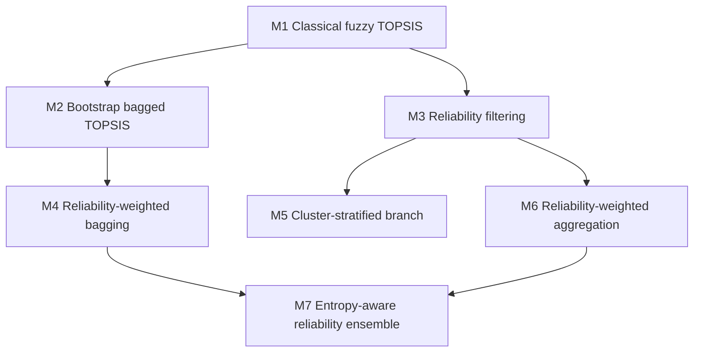

# Method Architecture and Proposed Methods

This document explains M1-M7 as a coherent research progression and identifies the three methods that should be presented as the main proposed contributions.

## Recommended Main Proposed Methods

The paper should not claim that all seven methods are equally proposed final methods. A cleaner Q1-ready framing is:

| Role | Method | Name | Why It Is Included |
|---|---|---|---|
| Proposed Method 1 | M4 | Reliability-Weighted Bagged Fuzzy TOPSIS | First strong bagged defense; keeps the ensemble idea but samples reliable DMs more often. |
| Proposed Method 2 | M6 | Reliability-Weighted Aggregation TOPSIS | Provides the strongest simple reliability-aware aggregation method. |
| Proposed Method 3 | M7 | Entropy-Aware Reliability-Weighted Ensemble TOPSIS | Final advanced method; strongest under structured majority contamination. |

The remaining methods should be explained, but as baseline or developmental variants:

| Method | Paper Role |
|---|---|
| M1 | Classical baseline. |
| M2 | Corrected bootstrap baseline / ensemble foundation. |
| M3 | Filtering ablation / intermediate reliability method. |
| M5 | Cluster-stratified ablation; useful but inconsistent. |

## Why These Three

M4, M6, and M7 form the strongest proposed-method ladder from the completed evidence:

1. M4 answers: does reliability-aware bootstrap sampling outperform plain bagging?
2. M6 answers: does reliability-weighted aggregation suppress biased DMs more directly?
3. M7 answers: can multi-signal reliability plus ensemble weighting handle structured majority contamination?

M2 remains essential in the paper, but as the corrected bootstrap baseline rather than a main proposed defense. The attack-fraction curves show that M2 improves over M1 but never fully blocks the structured target attack across the 18 publication-facing scenarios. M4 is therefore the better first proposed method.

They also have clean use cases:

| Method | Best Case | Weak Case | Computational Cost |
|---|---|---|---|
| M4 | Sub-majority contamination where reliability scores separate biased DMs from honest DMs | Majority contamination can shift the reliability center | Medium |
| M6 | Sub-majority structured/outlier contamination | Majority contamination can hijack centroid-style reliability | Medium |
| M7 | Structured, distinguishable coordinated attacks, including some majority attacks | Adaptive human-mimic attackers | Highest |

## Shared Notation

Let:

- \(A_i\), \(i=1,\dots,n\): alternatives.
- \(C_j\), \(j=1,\dots,m\): criteria.
- \(D_k\), \(k=1,\dots,K\): decision makers.
- \(\tilde{x}_{ijk}^{(k)}=(l_{ijk},m_{ijk},u_{ijk})\): triangular fuzzy rating for alternative \(i\), criterion \(j\), decision maker \(k\).
- \(\tilde{w}_j=(l_j^w,m_j^w,u_j^w)\): triangular fuzzy criterion weight.

The vertex distance between TFNs is:

\[
d(\tilde{a},\tilde{b}) =
\sqrt{
\frac{(a_l-b_l)^2+(a_m-b_m)^2+(a_u-b_u)^2}{3}
}
\]

The TOPSIS closeness coefficient is:

\[
CC_i = \frac{D_i^-}{D_i^+ + D_i^-}
\]

Higher \(CC_i\) means a better rank.

## M1: Classical Fuzzy TOPSIS Baseline

M1 is the reference method. It aggregates the full decision-maker panel:

\[
\tilde{x}_{ij} =
\left(
\min_k l_{ijk},
\frac{1}{K}\sum_{k=1}^K m_{ijk},
\max_k u_{ijk}
\right)
\]

For benefit criteria:

\[
\tilde{r}_{ij} =
\left(
\frac{l_{ij}}{u_j^+},
\frac{m_{ij}}{u_j^+},
\frac{u_{ij}}{u_j^+}
\right),
\quad
u_j^+ = \max_i u_{ij}
\]

For cost criteria:

\[
\tilde{r}_{ij} =
\left(
\frac{l_j^-}{u_{ij}},
\frac{l_j^-}{m_{ij}},
\frac{l_j^-}{l_{ij}}
\right),
\quad
l_j^- = \min_i l_{ij}
\]

Then:

\[
\tilde{v}_{ij} = \tilde{r}_{ij} \otimes \tilde{w}_j
\]

\[
A_j^+ = (\max_i v_{ij}^l,\max_i v_{ij}^m,\max_i v_{ij}^u)
\]

\[
A_j^- = (\min_i v_{ij}^l,\min_i v_{ij}^m,\min_i v_{ij}^u)
\]

M1 is interpretable but vulnerable. If coordinated DMs assign extreme ratings, the min/max aggregation envelope and final closeness coefficients can be distorted.

## M2: Bagged Fuzzy TOPSIS

M2 introduces Random-Forest-style bootstrap sampling over decision makers.

For each bag \(b=1,\dots,B\):

\[
S_b = \{D_{b1},\dots,D_{bK}\}, \quad D_{bt}\sim \text{Uniform}(D_1,\dots,D_K)
\]

Sampling is with replacement, and the default bag size is \(K\). Inside each bag, ratings are aggregated by component-wise mean:

\[
\tilde{x}_{ij}^{(b)} =
\left(
\frac{1}{|S_b|}\sum_{D_k\in S_b} l_{ijk},
\frac{1}{|S_b|}\sum_{D_k\in S_b} m_{ijk},
\frac{1}{|S_b|}\sum_{D_k\in S_b} u_{ijk}
\right)
\]

Each bag produces a TOPSIS ranking and closeness scores. Final aggregation uses:

\[
\text{Borda}_i = \sum_{b=1}^{B} (n-rank_i^{(b)})
\]

with average closeness coefficient as a secondary tie-breaker.

M2 is progressive from M1 because it changes the decision-maker sampling regime. It is not enough against coordinated contamination, but it is a necessary ensemble baseline.

## M3: Reliability Filtering

M3 computes a reliability score from each DM's distance to the median consensus vector.

Flatten each DM's full fuzzy rating tensor:

\[
\mathbf{x}_k \in \mathbb{R}^{3nm}
\]

Robust consensus center:

\[
\mathbf{c} = \text{median}(\mathbf{x}_1,\dots,\mathbf{x}_K)
\]

Distance:

\[
d_k = \|\mathbf{x}_k-\mathbf{c}\|_2
\]

Reliability:

\[
R_k = 1-\frac{d_k}{\max_s d_s}
\]

M3 filters out detected outliers and then runs fuzzy TOPSIS on the remaining decision makers. It is strong when attackers are a distinguishable minority, but can fail when attackers become the majority and shift the consensus structure.

## M4: Reliability-Weighted Bagging

M4 keeps the M2 ensemble structure but changes bag sampling probabilities:

\[
P(D_k) = \frac{R_k}{\sum_{s=1}^{K}R_s}
\]

Reliable DMs are sampled more often; unreliable DMs are sampled less often. Each sampled bag still runs fuzzy TOPSIS.

M4 tests whether reliability should influence who enters each bag. Based on the completed attack-fraction curves, it should be treated as the first proposed robustness method rather than only an ablation: it preserved the clean target rank through 40% effective structured contamination on all three publication-facing datasets. It still fails under majority contamination, which motivates M7.

## M5: Cluster-Stratified Bagging

M5 clusters decision makers by their flattened rating behavior:

\[
\mathbf{x}_k \rightarrow \text{cluster}(D_k)
\]

It then removes unreliable clusters and samples from the reliable clusters in a stratified way.

The idea is attractive because coordinated attackers may form a behavioral cluster. However, M5 is inconsistent in the experiments: sometimes it helps, sometimes it behaves like M2. It should be discussed as an explored design branch, not as a main final method.

## M6: Reliability-Weighted Fuzzy TOPSIS

M6 is the cleanest reliability-aware method. It does not merely filter DMs or sample them more often; it directly weights their contribution in the fuzzy aggregation:

\[
\tilde{x}_{ij}^{(R)} =
\left(
\frac{\sum_k R_k l_{ijk}}{\sum_k R_k},
\frac{\sum_k R_k m_{ijk}}{\sum_k R_k},
\frac{\sum_k R_k u_{ijk}}{\sum_k R_k}
\right)
\]

Then normal fuzzy TOPSIS is applied.

M6 is progressive from M3/M4:

- M3 uses binary inclusion/exclusion.
- M4 uses reliability only for sampling.
- M6 uses reliability directly inside the fuzzy ratings.

M6 is an excellent proposed method because it is mathematically simple, interpretable, and strong under sub-majority structured contamination. It differs from M4 because reliability is applied to the TFN aggregation itself, not only to the probability of entering a bag.

## M7: Entropy-Aware Reliability-Weighted Ensemble TOPSIS

M7 is the final advanced method. It replaces single-signal consensus distance with a multi-signal reliability model.

### Entropy Signal

For each DM vector \(\mathbf{x}_k\), form a histogram distribution \(p_{kh}\). Shannon entropy:

\[
H_k = -\sum_h p_{kh}\log(p_{kh})
\]

Normalized entropy reliability:

\[
R_k^{(H)} = \frac{H_k}{\max_s H_s}
\]

Low entropy often indicates repeated attack patterns such as always assigning \((7,9,9)\) to the target and \((1,1,3)\) elsewhere.

### Variance-Consistency Signal

Let \(\sigma_k^2=\text{Var}(\mathbf{x}_k)\), and let \(\tilde{\sigma}^2\) be the median individual variance:

\[
R_k^{(V)} =
\exp\left(
-\left|\frac{\sigma_k^2}{\tilde{\sigma}^2}-1\right|
\right)
\]

This penalizes DMs whose rating spread is statistically unusual.

### Clone/Agreement Signal

Pairwise distances are computed between DM vectors. If many DMs are near-identical, the clone penalty increases:

\[
R_k^{(C)} = \exp(-3\cdot clone\_fraction_k)
\]

### Composite Reliability

\[
R_k =
0.35R_k^{(H)}
+0.35R_k^{(V)}
+0.30R_k^{(C)}
\]

Gap analysis can set a low-reliability group close to zero when there is a clear reliability separation.

### M7 Ensemble Pipeline

M7 combines three layers:

1. Probability-weighted bootstrap sampling:

\[
P(D_k)=\frac{R_k}{\sum_s R_s}
\]

2. Inner-bag reliability-weighted aggregation:

\[
\tilde{x}_{ij}^{(b,R)} =
\frac{\sum_{D_k\in S_b} R_k\tilde{x}_{ijk}}
{\sum_{D_k\in S_b} R_k}
\]

3. Outer-bag softmax weighting:

\[
W_b = \frac{\exp(q_b/T)}{\sum_{s=1}^B \exp(q_s/T)}
\]

where \(q_b\) is the mean reliability of bag \(b\), and \(T\) is self-calibrated from the standard deviation of bag reliabilities.

Final closeness:

\[
CC_i^{final} = \sum_{b=1}^{B} W_b CC_i^{(b)}
\]

M7 is progressive from M6 because it adds better reliability evidence and ensemble-level weighting. It is the strongest method under structured, distinguishable coordinated attacks, including tested majority contamination.

## Progressive or Separate?

The methods are partly progressive and partly branching:



Use this language in the paper:

> M1 is the classical baseline. M2 introduces corrected bootstrap resampling and should be reported as the ensemble baseline. M3 introduces reliability filtering. M4 is the first proposed defense because it combines reliability with bagged sampling. M5 is a cluster-stratified branch that is useful but inconsistent. M6 is the second proposed defense because it applies reliability directly inside fuzzy aggregation. M7 is the final proposed defense because it integrates entropy, variance, clone/agreement signals, reliability-weighted sampling, reliability-weighted aggregation, and bag-quality weighting.

## Simple Example of Why M1 Fails

If the clean target \(A_1\) is last, but attackers assign:

```text
Target A1: (7, 9, 9)
All other alternatives: (1, 1, 3)
```

then M1's full-panel aggregation directly includes those extreme ratings. If enough attackers exist, the closeness coefficient of \(A_1\) rises sharply and \(A_1\) can move to rank 1.

M2 reduces variance, but most bootstrap bags still contain attackers when the attacker fraction is large.

M6 reduces the attackers' influence if their reliability scores are low.

M7 is stronger because it can identify structured attack patterns using entropy, clone similarity, and variance consistency rather than relying only on distance to a consensus center.

## Claim Boundaries

The correct claim is:

> M7 is robust against structured, statistically distinguishable coordinated manipulation in the tested fuzzy TOPSIS settings.

The incorrect claim is:

> M7 detects all human bias or all strategic adversaries.

Adaptive human-mimic attackers remain a limitation because they deliberately make malicious ratings look statistically similar to honest human variation.
