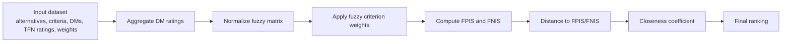
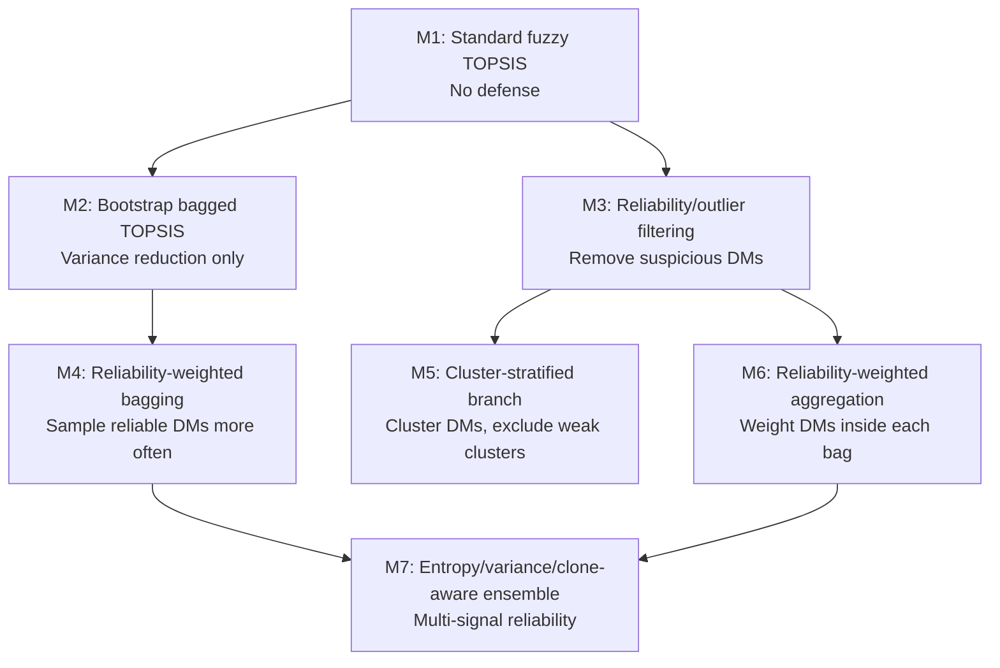
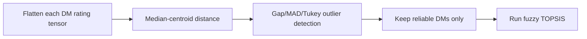
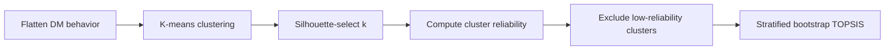
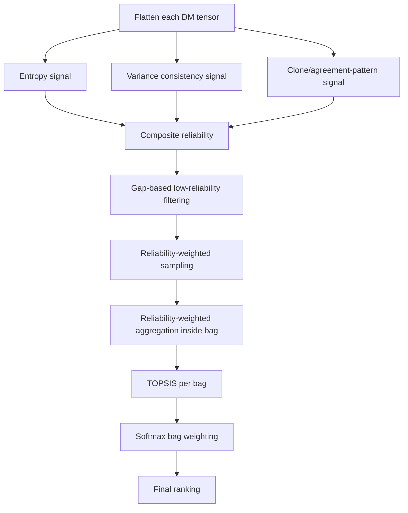

# DR-BFTOPSIS / EARR-TOPSIS Draft Status Report

Date: 2026-05-16

This report summarizes the current state of the fuzzy TOPSIS research codebase, the algorithmic progression from M1 to M7, the evidence collected so far, known limitations, and the remaining work needed before a Q1 journal submission.

## 1. Executive Verdict

The main research hypothesis is being supported by the experiments so far:

> Conventional fuzzy TOPSIS and simple bootstrap/bagging variants are vulnerable to coordinated decision-maker bias, while reliability-aware filtering/weighting can substantially reduce targeted rank manipulation when the biased decision makers exhibit structurally distinguishable behavior.

The current project is now technically thesis/journal-draft ready as an evidence package, but the manuscript itself still needs final writing polish and supervisor-approved citation framing before journal submission. The evidence is strongest for structured coordinated attacks, especially perfect-clone or near-clone manipulation. The evidence is weaker against adaptive "human-mimic" attackers: these are not ordinary honest human inputs, but deliberately constructed adversarial ratings that try to look statistically human while still pushing a target alternative upward.

Current readiness estimate:

| Area | Status |
|---|---|
| Core prototype | Strong |
| M2 bootstrap correction | Completed |
| Deterministic seeds | Added |
| Mixed benefit/cost criteria handling | Added |
| Synthetic validation | Repeated-run evidence collected |
| Real-data validation | Promising with clear pseudo-panel framing |
| Attack-fraction curves | Completed for 3 larger datasets |
| Consolidated evidence tables | Added |
| External comparator baselines | Added, including one Huang-Li group-ideal TOPSIS adaptation |
| Statistical testing | CI and paired target-error tests added |
| Runtime/scalability | Added |
| Hand-computed validation example | Added |
| Q1 manuscript readiness | Evidence package substantially complete; manuscript writing and final citation selection remain |

### Recommended three proposed methods

The paper should not present all seven methods as equal final contributions. The cleanest framing is:

| Proposed role | Method | Why this method should be proposed |
|---|---|---|
| Proposed Method 1 | M4 Reliability-weighted bagging | First strong bagged defense; preserved the target rank through 40% effective structured contamination across the three larger datasets. |
| Proposed Method 2 | M6 Reliability-weighted aggregation | Simpler and interpretable reliability-aware aggregation; also strong through 40% effective structured contamination. |
| Proposed Method 3 | M7 Entropy-aware reliability ensemble | Final advanced method; preserved the target rank across all tested structured fractions, including 53.3% and 60.0% effective contamination. |

M2 should stay in the paper, but as the corrected bootstrap baseline rather than a main proposed method. M5 should be explained as a cluster-stratified branch; it is conceptually useful but experimentally inconsistent.

## Bias and Attack Types: Important Clarification

The phrase "human-mimic attack" can be confusing. It does not mean ordinary human input, and it does not mean that M7 fails whenever humans are biased. It means a deliberately adaptive adversarial setting where malicious decision makers know that the method detects abnormal patterns, so they intentionally add human-like variation to hide their manipulation.

In the current experiments there are four different ideas that must be separated:

| Case | Meaning | Example | Expected M7 behavior |
|---|---|---|---|
| Honest human variation | DMs naturally disagree or use slightly different fuzzy ratings | One DM rates A1 as [5,6,7], another as [4,6,8] | Should not be penalized |
| Ordinary human bias | A DM genuinely or subjectively favors one alternative | One DM consistently likes Supplier A because of past experience | May be tolerated unless the pattern is extreme/outlying |
| Structured coordinated attack | Several DMs intentionally push one target up and others down in a very similar way | Four DMs all give target [7,9,9] and others [1,1,3] | M7 performs strongly in larger tests |
| Adaptive human-mimic attack | Malicious DMs still push the target, but add human-like noise to avoid looking like clones/outliers | Attackers vary ratings so their vectors look statistically similar to honest DMs | M7 is not guaranteed and can fail |

### Example 1: Ordinary Human Bias

This is a human who likes A1 too much, but still gives varied ratings across alternatives:

```text
DM4 ratings:
A1: [7, 8, 9]
A2: [5, 6, 7]
A3: [4, 5, 6]
A4: [5, 7, 8]
```

This is not automatically an attack. It may be a real preference, a subjective judgment, or mild bias. M7 should not remove every DM who has a preference. In group decision-making, disagreement is normal and sometimes valuable.

### Example 2: Structured Coordinated Bias

This is the kind of contamination used in the real-dataset benchmark:

```text
DM12, DM13, DM14, DM15 all behave like this:

Target A1: [7, 9, 9]
A2:        [1, 1, 3]
A3:        [1, 1, 3]
A4:        [1, 1, 3]
...
```

This creates a strong abnormal pattern:

- low entropy because the same values repeat;
- clone-like similarity because attackers look nearly identical;
- directional distortion because one target is pushed up while everything else is pushed down.

This is where M7 performs strongly. In the healthcare, car, and healthcare-resource experiments, M7 preserved the clean target rank under this structured contamination.

### Example 3: Adaptive Human-Mimic Attack

This is a stronger adversarial stress test, not the same as normal human bias:

```text
Attacker DM12:
A1: [6, 8, 9]
A2: [2, 4, 5]
A3: [3, 4, 6]
A4: [2, 3, 5]

Attacker DM13:
A1: [7, 8, 9]
A2: [3, 4, 6]
A3: [2, 5, 6]
A4: [3, 4, 5]

Attacker DM14:
A1: [6, 7, 9]
A2: [2, 5, 6]
A3: [3, 4, 5]
A4: [2, 4, 6]
```

The attackers still favor A1, but they are no longer perfect clones. Their ratings vary enough to look more like natural human disagreement. In this case, entropy and clone detection become less reliable. If attackers are statistically indistinguishable from honest DMs, an unsupervised reliability method cannot guarantee detection without additional information such as historical trust, known expertise, external ground truth, or supervised labels.

Therefore, the correct interpretation is:

> M7 is not a universal detector of all human bias. It is a robustness mechanism against structured and statistically distinguishable coordinated bias. It works well when malicious behavior leaves detectable traces. It is not guaranteed when malicious behavior is deliberately disguised as normal human variation.

This is not a failed research result. It is the method's threat-model boundary, and it should be explicitly reported.

## 2. What Has Been Done So Far

### Code-level work completed

1. M2 was corrected from disjoint partitioning to true Random-Forest-style bootstrap sampling with replacement.
2. Deterministic seed parameters were added to stochastic methods.
3. A real-dataset benchmark runner was created to test M1 through M7 on clean and contaminated real/pseudo-real datasets.
4. A repeated synthetic evaluation script was created for repeated-seed validation.
5. The benchmark runner was improved with per-method progress printing, dataset filtering, and a faster Kendall tau calculation.
6. M7 entropy computation was corrected to use histogram probabilities rather than histogram densities.
7. The M7 ablation script conclusion was corrected so it no longer overclaims that every component is individually necessary.
8. M1-M7 now pass optional `criteria_types` into normalization, so mixed benefit/cost criteria can be represented directly in JSON instead of requiring pre-conversion.
9. M5's cluster-stratified allocation now guards custom small bag sizes.
10. A final evidence compiler was added to collect saved real and synthetic outputs into CSV, Markdown, and LaTeX tables for thesis and paper drafting.

### Important implementation note

Some real datasets are not native group decision-maker fuzzy TOPSIS datasets. For crisp datasets, the current benchmark creates deterministic pseudo-DM fuzzy panels by normalizing values into a 1-9 scale and adding bounded noise. This is acceptable for robustness experiments, but the paper must state this conversion protocol clearly.

## 3. Shared Fuzzy TOPSIS Pipeline



The ranking is produced by sorting the closeness coefficient in descending order. Higher closeness means the alternative is closer to the fuzzy positive ideal solution and farther from the fuzzy negative ideal solution.

## 4. Method Architecture: M1 to M7



The progression is not a single straight chain. M2 is the corrected ensemble baseline; M3 is the first reliability detector; M4, M6, and M7 are the three recommended proposed methods. M5 is retained as an explored cluster-stratified branch because it helps in some settings but is not stable enough to headline.

### M1: Standard fuzzy TOPSIS

Architecture:


Purpose:

M1 is the baseline. It implements conventional fuzzy TOPSIS using the full decision-maker panel.

Strengths:

- Simple and interpretable.
- Matches the classical fuzzy TOPSIS baseline.
- Useful as the clean-reference ranking.
- Supports optional mixed benefit/cost criteria through `criteria_types`.

Limitations:

- Vulnerable to coordinated bias because all decision makers contribute.
- The min/max aggregation envelope can be widened by extreme ratings.
- If `criteria_types` is omitted, the method defaults to benefit-style criteria for backward compatibility.

Experimental behavior:

M1 often collapses under targeted contamination. For example, in healthcare countries, Romania moved from clean rank 26 to contaminated rank 1.

### M2: Bootstrap bagged fuzzy TOPSIS

Architecture:


Purpose:

M2 tests whether Random-Forest-style bootstrap aggregation alone can protect fuzzy TOPSIS.

Strengths:

- Now correctly uses true bootstrap sampling with replacement.
- Reduces random variation.
- Provides an important intermediate baseline.

Limitations:

- It has no concept of reliability or adversarial behavior.
- If the biased group is large enough, most bags still contain biased decision makers.
- The experiments show M2 improves over M1 sometimes but does not fully neutralize coordinated attacks.

Experimental behavior:

In healthcare countries, M2 moved the attack target from rank 26 to rank 7 under contamination. This is better than M1 rank 1, but still far from recovery.

### M3: Reliability/outlier-filtered fuzzy TOPSIS

Architecture:



Purpose:

M3 tests whether removing suspicious decision makers before TOPSIS can defend the ranking.

Strengths:

- Strong when biased DMs are a minority and structurally far from honest DMs.
- Frequently restores the clean target rank in real/pseudo-real tests.
- Simple and explainable.

Limitations:

- Can fail when attackers are 50% or more.
- Can fail when attackers mimic human-like noise.
- Depends strongly on the reliability detector.

Experimental behavior:

M3 is one of the strongest current baselines. In healthcare countries, car evaluation, and healthcare resource allocation, M3 restored the target to the clean last rank under 26.7% contamination.

### M4: Reliability-weighted bagging

Architecture:


Purpose:

M4 tests whether bagging improves when reliable DMs are sampled more often. Based on the completed attack-fraction curves, M4 should be one of the three proposed methods because it is the first method in the sequence that consistently blocks the structured attack through 40% effective contamination.

Strengths:

- Combines ensemble sampling with reliability.
- Strong in many structured-bias experiments.
- Often restores the contaminated target to its clean position.

Limitations:

- If reliability scores are wrong, sampling reinforces the wrong group.
- It can distort clean rankings in some synthetic tests.
- It does not weight DMs inside each bag; it only affects selection probability.

Experimental behavior:

M4 is strong in real/pseudo-real tests and preserved the clean target rank through 40% effective structured contamination on all three publication-facing datasets. It collapses at majority contamination, which creates the motivation for M7.

### M5: Cluster-stratified bagging

Architecture:



Purpose:

M5 tests a group-behavior defense: identify clusters of decision makers and reduce the influence of low-reliability clusters.

Strengths:

- Conceptually useful when attackers form a detectable cluster.
- Adds a group-level view, not just individual reliability.

Limitations:

- Current results are inconsistent.
- It fails in several synthetic and real/pseudo-real contamination cases.
- It should be treated as an intermediate method, not the main contribution.

Experimental behavior:

M5 often improves over M1 but is weaker than M4, M6, and M7 in many tests. In healthcare countries, it moved the target from clean rank 26 to contaminated rank 5, which is still a major attack success.

### M6: Reliability-weighted aggregation

Architecture:


Purpose:

M6 tests whether reliability should be applied inside the aggregation step, not only during sampling.

Strengths:

- Very strong when reliability scores correctly identify suspicious DMs.
- Biased DMs contribute near-zero influence even if sampled.
- Often matches M3/M4/M7 in real/pseudo-real tests.

Limitations:

- Still depends on reliability score quality.
- Can fail when the reliability model is hijacked.
- Can distort some clean/synthetic cases.

Experimental behavior:

M6 is one of the strongest current methods. In healthcare countries, car evaluation, and healthcare resource allocation, it preserved the clean target rank under 26.7% contamination.

### M7: Entropy-aware reliability-weighted ensemble TOPSIS

Architecture:



Purpose:

M7 is the candidate final method. It avoids relying only on distance to a median centroid and instead uses multiple signals from each DM's own rating behavior.

Strengths:

- Strong against perfect-clone and structured coordinated attacks.
- Can defend against some super-majority attacks where M1-M6 fail.
- Combines sampling, inner aggregation, and outer bag weighting.

Limitations:

- Does not defeat all attacks.
- Adaptive human-mimic attacks remain a serious limitation; this refers to deliberate evasion, not ordinary human disagreement.
- Current ablation results show entropy and clone-style signals dominate; they do not prove every component is individually necessary.

Experimental behavior:

M7 performs strongly in real/pseudo-real contamination tests and in several super-majority structured-attack tests. In the separate adversarial stress test, it fails against adaptive human-mimic attackers that intentionally hide their bias pattern inside human-like noise. This should not be interpreted as "M7 fails on human input"; it means M7 is not guaranteed when malicious DMs deliberately make their ratings statistically similar to honest DMs.

## 5. Testing Outputs and Current Verdicts

### Real/pseudo-real benchmark: 80-alternative run

Attack setting: 30% requested attacker fraction, 15 pseudo-DMs for crisp datasets, effective attack fraction around 26.7%.

| Dataset | Clean target rank | M1 contaminated | M2 contaminated | M3 | M4 | M5 | M6 | M7 | Verdict |
|---|---:|---:|---:|---:|---:|---:|---:|---:|---|
| Healthcare countries 2021 | 26 | 1 | 7 | 26 | 26 | 5 | 26 | 26 | Strong support |
| Car evaluation, 80 alts | 80 | 1 | 31 | 80 | 80 | 31 | 80 | 80 | Strong support |
| Healthcare resource allocation, 80 alts | 80 | 1 | 26 | 80 | 80 | 26 | 80 | 80 | Strong support |
| Supplier Beg/Rashid | 4 | 1 | 1 | 1 | 1 | 1 | 1 | 1 | Diagnostic only; 2 DMs |
| Supplier Wu | 4 | 1 | 1 | 1 | 1 | 1 | 1 | 2 | Diagnostic only; 2 DMs |

Interpretation:

- The supplier datasets are too small for publication-grade robustness claims.
- The larger datasets strongly support the vulnerability-and-defense story.
- M4, M6, and M7 are the recommended proposed methods; M3 is a strong intermediate comparator.
- M5 is inconsistent and should not be overemphasized.

### Full car-evaluation run

Dataset: 1,728 alternatives, 6 criteria, 15 pseudo-DMs.

| Method | Target rank under contamination | Target-rank error |
|---|---:|---:|
| M1 | 340 | 1388 |
| M2 | 1235 | 493.467 |
| M3 | 1728 | 0 |
| M4 | 1728 | 0 |
| M5 | 1465 | 263.567 |
| M6 | 1728 | 0 |
| M7 | 1728 | 0 |

Interpretation:

Spearman/Kendall remain high because only part of a very large ranking changes, but the target-rank error exposes the attack. This is important for the paper: global rank correlation alone hides targeted manipulation.

### Full attack-fraction curves

The full curve was run on the three publication-facing larger datasets with 30 repeats and 200 bags. The table below reports the attacked target's contaminated rank. The clean target rank is the last rank in each dataset, so preserving the clean rank means the attack was blocked.

| Dataset | Clean target rank | Effective attack | M1 | M2 | M3 | M4 | M5 | M6 | M7 |
|---|---:|---:|---:|---:|---:|---:|---:|---:|---:|
| Healthcare countries 2021 | 26 | 13.3% | 1 | 18 | 26 | 26 | 19 | 26 | 26 |
| Healthcare countries 2021 | 26 | 20.0% | 1 | 11 | 26 | 26 | 11 | 26 | 26 |
| Healthcare countries 2021 | 26 | 26.7% | 1 | 7 | 26 | 26 | 5 | 26 | 26 |
| Healthcare countries 2021 | 26 | 40.0% | 1 | 2 | 26 | 26 | 26 | 26 | 26 |
| Healthcare countries 2021 | 26 | 53.3% | 1 | 1 | 1 | 1 | 1 | 1 | 26 |
| Healthcare countries 2021 | 26 | 60.0% | 1 | 1 | 1 | 1 | 1 | 1 | 26 |
| Car evaluation | 300 | 13.3% | 78 | 272 | 300 | 300 | 289 | 300 | 300 |
| Car evaluation | 300 | 20.0% | 48 | 230 | 300 | 300 | 258 | 300 | 300 |
| Car evaluation | 300 | 26.7% | 24 | 180 | 300 | 300 | 192 | 300 | 300 |
| Car evaluation | 300 | 40.0% | 1 | 77 | 300 | 300 | 300 | 300 | 300 |
| Car evaluation | 300 | 53.3% | 1 | 18 | 1 | 1 | 1 | 1 | 300 |
| Car evaluation | 300 | 60.0% | 1 | 8 | 1 | 1 | 1 | 1 | 300 |
| Healthcare resource allocation | 300 | 13.3% | 3 | 168 | 300 | 300 | 166 | 300 | 300 |
| Healthcare resource allocation | 300 | 20.0% | 1 | 101 | 300 | 300 | 62 | 300 | 300 |
| Healthcare resource allocation | 300 | 26.7% | 1 | 52 | 300 | 300 | 16 | 300 | 300 |
| Healthcare resource allocation | 300 | 40.0% | 1 | 11 | 300 | 300 | 300 | 300 | 300 |
| Healthcare resource allocation | 300 | 53.3% | 1 | 1 | 1 | 1 | 1 | 1 | 300 |
| Healthcare resource allocation | 300 | 60.0% | 1 | 1 | 1 | 1 | 1 | 1 | 300 |

Interpretation:

- M1 collapses early and often moves the attacked target to rank 1.
- M2 degrades gradually but does not stop target promotion.
- M3, M4, and M6 are strong through 40% effective contamination, but collapse at majority contamination.
- M7 preserves the clean target rank at every tested structured contamination level, including 53.3% and 60.0%.
- This supports the M7 contribution under structured, statistically distinguishable attacks; it does not remove the separate human-mimic limitation.

### External comparator baselines

Five external comparator baselines were added. EB1-EB4 are robust/consensus comparators inspired by common group-MCDM practice. EB5 is a closer adaptation of Huang and Li's group-ideal TOPSIS aggregation model using each DM's individual fuzzy TOPSIS closeness coefficients.

| Baseline | Meaning |
|---|---|
| EB1 Median TOPSIS | Component-wise median TFN aggregation, then fuzzy TOPSIS |
| EB2 Trimmed-Mean TOPSIS | 20% component-wise trimmed mean aggregation, then fuzzy TOPSIS |
| EB3 MAD-Consensus TOPSIS | Median-vector consensus filtering using MAD/IQR logic, then fuzzy TOPSIS |
| EB4 Individual-Borda TOPSIS | Individual DM TOPSIS rankings aggregated with Borda voting |
| EB5 Huang-Li Group-Ideal TOPSIS | Individual DM fuzzy TOPSIS closeness values aggregated using preferential differences, alternative priorities, and group ideal distances |

Across the 18 attack-fraction scenarios:

| Method | Blocked cases | Blocked rate | Mean target-rank error |
|---|---:|---:|---:|
| EB1 Median TOPSIS | 8/18 | 44.4% | 71.11 |
| EB2 Trimmed-Mean TOPSIS | 6/18 | 33.3% | 106.44 |
| EB3 MAD-Consensus TOPSIS | 12/18 | 66.7% | 69.22 |
| EB4 Individual-Borda TOPSIS | 0/18 | 0.0% | 66.94 |
| EB5 Huang-Li Group-Ideal TOPSIS | 0/18 | 0.0% | 188.22 |
| M7 | 18/18 | 100.0% | 0.00 |

Interpretation:

The external baselines make the contribution stronger. Robust aggregation and consensus filtering can handle low-to-moderate contamination, but they collapse at majority contamination because the robust center or aggregate becomes contaminated. The Huang-Li aggregation adaptation is important for prior-art comparison, but it assumes honest decision makers and does not include adversarial reliability detection; it was therefore strongly vulnerable to the targeted contamination. M7 remained stable under the structured attack model.

### Statistical and runtime reporting

The statistical analysis now includes:

- 95% confidence interval tables from repeated-run summaries;
- paired sign-test and Wilcoxon-style target-rank-error comparisons across dataset/fraction scenarios;
- method-level blocked-rate and target-error summaries.

M7 had lower target-rank error than M1 and M2 in all 18 attack-fraction scenarios, with paired sign-test p = 0.000008. Compared with M3, M4, and M6, M7 improved the six majority/high-contamination scenarios and tied the remaining twelve, with approximate Wilcoxon p = 0.036.

Runtime snapshot at the 30% contaminated setting with 200 bags:

| Dataset | M1 sec | M2 sec | M6 sec | M7 sec |
|---|---:|---:|---:|---:|
| Healthcare countries 2021 | 0.004 | 0.380 | 0.291 | 0.315 |
| Car evaluation, 300 alts | 0.028 | 2.196 | 1.728 | 1.818 |
| Healthcare resource allocation, 300 alts | 0.077 | 6.809 | 5.468 | 5.731 |

Interpretation:

M7 is computationally heavier than M1/M3 but comparable to the other ensemble methods. On the largest 300-alternative, 18-criterion benchmark, a single M7 run with 200 bags took about 5.73 seconds; projected 30-repeat runtime is about 172 seconds.

### Synthetic M1-M6 validation

Main findings:

- M1 and M2 fail repeatedly under coordinated bias.
- M2 is useful as a corrected bootstrap baseline, but not sufficient as a defense.
- M3/M4/M6 are strong in many minority-bias cases.
- M5 is unstable.
- At exact 50% bias, earlier reliability methods can fail.
- Some methods can over-correct and demote A1 even when A1 is genuinely strong; this is a false-positive risk.

### M7 super-majority tests

M7 defended in several structured majority attacks:

| Scenario | M1-M6 | M7 |
|---|---|---|
| 10 DMs, 60% perfect-clone bias | Fail | Defends |
| 20 DMs, 70% perfect-clone bias | Fail | Defends |
| 10 DMs, exact 50% perfect-clone bias | Fail | Fails |
| 20 DMs, 60% perfect-clone bias | Fail | Perfect recovery |

Interpretation:

M7 can beat majority attacks when the attack has a detectable abnormal structure. However, it is not universally majority-proof.

### M7 adversarial degradation map

| Attack level | 30% | 50% | 60% |
|---|---|---|---|
| Perfect clones | Defends | Defends | Defends |
| Noisy clones +/-1 | Fails at 30% | Defends | Defends |
| Noisy clones +/-2 | Partial/defends | Partial/defends | Fails |
| Diverse extremists | Defends | Defends | Fails |
| Human mimics | Fails | Fails | Fails |

Interpretation:

This is the most important limitation. The "human mimic" row is not ordinary human bias. It is an adaptive evasion case where attackers intentionally avoid clone-like or low-entropy patterns. M7 should therefore be claimed as robust against distinguishable coordinated behavior, not against all strategic adversaries.

## 6. Code Review Findings

| Finding | Status | Severity |
|---|---|---|
| M2 did not originally implement true bootstrap | Fixed | High |
| Stochastic methods lacked deterministic seeds | Fixed | High |
| M7 entropy used histogram density instead of probability | Fixed | High |
| M7 ablation conclusion overclaimed component necessity | Fixed | Medium |
| M1 lacked explicit cost-criteria support | Fixed | Medium |
| M5 custom small bag sizes could produce invalid allocation | Fixed | Low |
| M5 is experimentally inconsistent | Open/design limitation | Medium |
| Test labels such as "neutralized" can hide false positives | Open/reporting limitation | Medium |
| Current real-data conversions need explicit protocol wording | Open/paper limitation | High |
| External prior-art comparator baselines | Fixed | High |

## 7. Is the Code Perfect?

No. It is much improved, but it is not perfect.

The core code now runs and the main M2/M7 correctness issues discovered so far have been fixed. The evidence package now includes external baselines, statistical summaries, runtime tables, and a hand-computed validation example. Before final journal submission, the remaining work is mainly manuscript-level:

- avoid overclaiming in comments, reports, and paper text;
- rerun final benchmark tables after any future code freeze;
- ensure the real/pseudo-real conversion protocol is stated clearly;
- decide with the supervisor whether EB5 is sufficient as a direct prior-art adaptation or whether one additional exact published comparator should be reproduced.

## 8. Suggested Paper Hypotheses

H1:

Standard fuzzy TOPSIS is vulnerable to coordinated rating manipulation, especially when adversarial decision makers push a low-ranked target alternative upward.

H2:

Bootstrap bagging alone reduces variance but does not reliably neutralize coordinated bias because contaminated decision makers still appear in most bags.

H3:

Reliability-aware filtering and aggregation reduce targeted rank manipulation when adversarial decision makers are structurally distinguishable from honest decision makers.

H4:

Multi-signal reliability modeling using entropy, variance consistency, and clone/agreement-pattern signals improves robustness against structured majority attacks, while its limitations appear when adversaries deliberately mimic honest human rating variation.

H5:

The proposed method is expected to handle ordinary human disagreement and some forms of human bias when they create detectable reliability patterns; however, it cannot guarantee detection when biased DMs are statistically indistinguishable from honest DMs.

## 9. What Is Still Required for Q1 Readiness

Minimum remaining work:

1. Decide whether the Huang-Li group-ideal TOPSIS adaptation plus the four robust comparators are enough for the professor, or whether one more exact published comparator should be reproduced.

2. Freeze the method definitions and avoid changing M7 before final manuscript tables.

3. Add selected parameter sensitivity only if required, such as different bag counts.

4. Keep failure analysis:
   - exact 50% tie cases;
   - human-mimic attacks;
   - legitimate minority preference cases;
   - false-positive clean-rank distortion.

5. Rewrite the claims carefully:
   - do not say "universal robustness";
   - do not say "always defeats majority bias";
   - say "robust under distinguishable structured coordinated attacks."

6. Convert the generated evidence tables into final journal-table formatting with references.

## 10. Recommended Paper Structure

1. Introduction
   - Motivation: group decision-making can be manipulated by coordinated decision makers.
   - Problem: fuzzy TOPSIS lacks robust safeguards against adversarial DM behavior.
   - Contribution: step-by-step reliability-aware ensemble framework.

2. Related Work
   - Fuzzy TOPSIS.
   - Group decision-making reliability.
   - Outlier detection in MCDM.
   - Ensemble methods and robust aggregation.

3. Methodology
   - M1 baseline.
   - M2 bootstrap bagging.
   - M3 reliability filtering.
   - M4 reliability-weighted bagging as Proposed Method 1.
   - M5 cluster-stratified bagging.
   - M6 reliability-weighted aggregation as Proposed Method 2.
   - M7 entropy-aware reliability ensemble as Proposed Method 3.

4. Experimental Design
   - Synthetic datasets.
   - Real/pseudo-real datasets.
   - Attack models.
   - Evaluation metrics.
   - Repeated seeds.

5. Results
   - Clean stability.
   - Contaminated robustness.
   - Attack-fraction curves.
   - Ablation.
   - Runtime.

6. Discussion
   - Why M1/M2 fail.
   - Why reliability helps.
   - When M7 helps beyond M6.
   - Failure cases and limitations.

7. Conclusion
   - Summary of robustness gains.
   - Limitations.
   - Future work.

## 11. Short Professor-Facing Summary

The project has progressed from a baseline fuzzy TOPSIS implementation to a multi-stage reliability-aware ensemble framework. The corrected M2 now properly implements bootstrap sampling with replacement and should be reported as the ensemble baseline. The three recommended proposed methods are M4, M6, and M7. The real/pseudo-real experiments show that conventional fuzzy TOPSIS can be strongly manipulated by coordinated decision makers. The completed attack-fraction curves strengthen the contribution: M4 and M6 preserved the clean target rank through 40% effective structured contamination, and M7 preserved it across all tested structured contamination levels, including 53.3% and 60.0% effective contamination. External comparator baselines, including a Huang-Li group-ideal TOPSIS adaptation, statistical summaries, and runtime tables have now been added. M7 is still not universally robust against adaptive attackers who deliberately mimic honest human rating variation. The evidence package is now ready to support thesis and journal-paper writing, but the manuscript must keep claims narrow and use the final citations approved by the supervisor.
